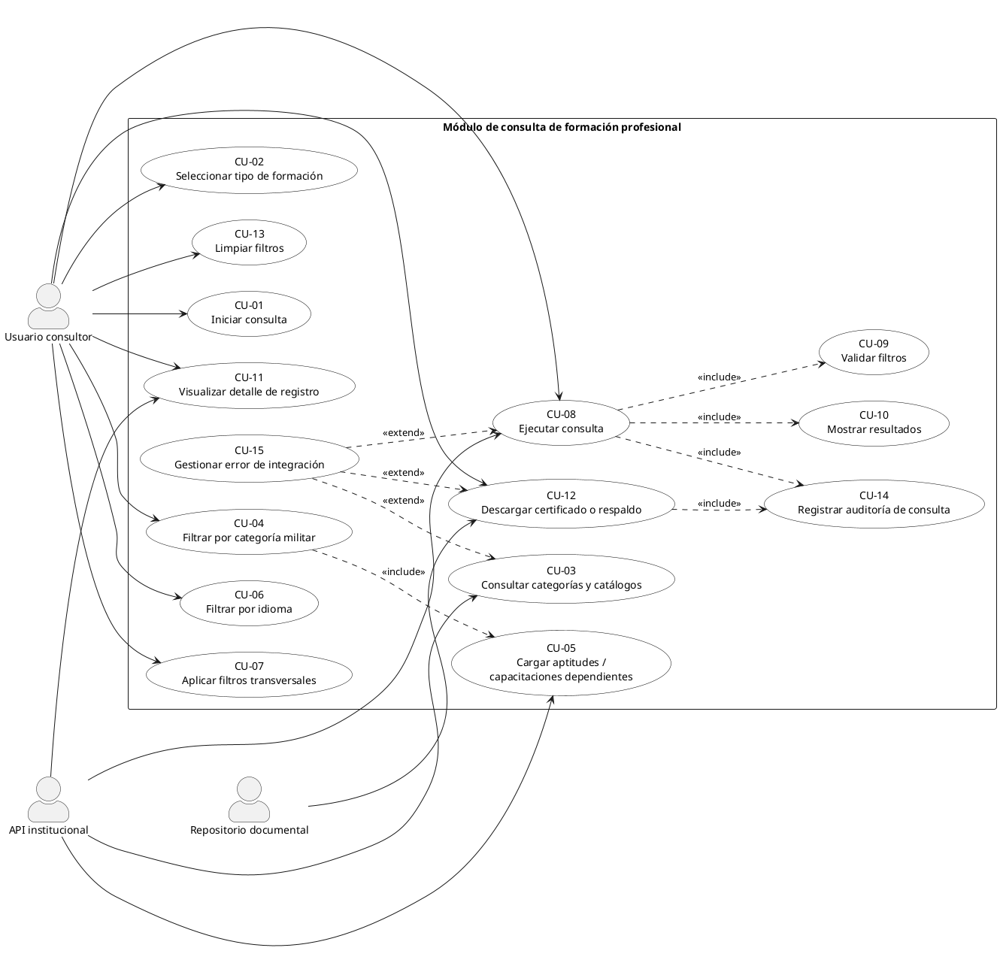
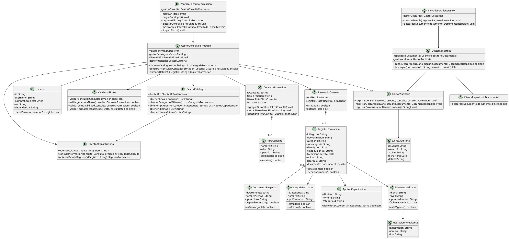
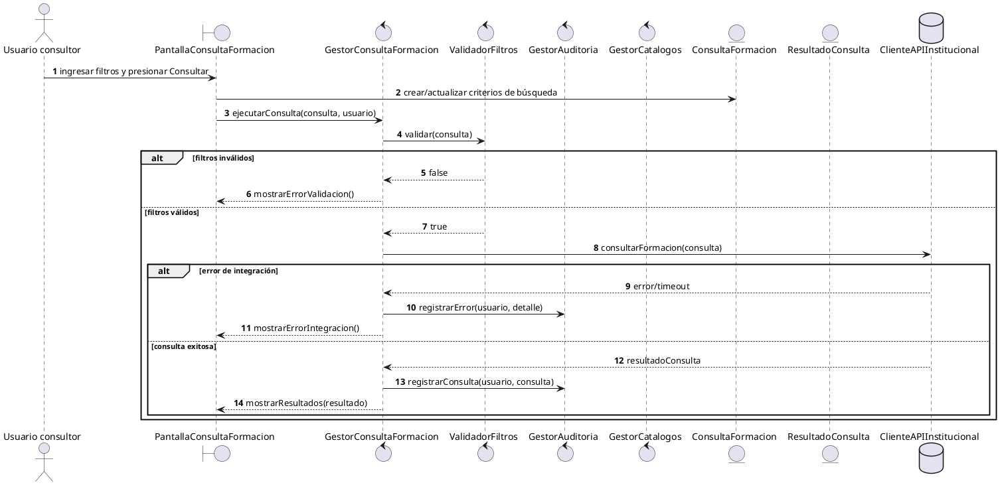
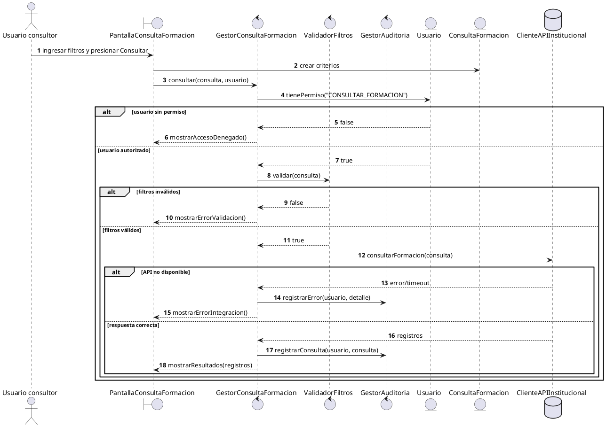

Se llama **PMBOK**, no “PMBox”.

Y sí: tengo base suficiente para armarte la **documentación completa de un proyecto** con enfoque PMBOK, más una capa extra específica para **software**.

Hoy, PMI presenta el **PMBOK Guide como estándar global de gestión de proyectos**, y en su sitio figura la **Octava Edición**; la **Séptima** sigue disponible porque todavía se usa mucho en formación y práctica. Además, el enfoque actual no obliga a un paquete rígido único: habla de principios, dominios de desempeño y adaptación según el tipo de proyecto. ([Instituto de Gestión de Proyectos][1])

La documentación que normalmente corresponde armar es esta:

**Inicio**

* **Acta de constitución del proyecto (Project Charter)**: autoriza formalmente el proyecto y suele incluir objetivos, alcance preliminar, interesados clave, hitos, riesgos, supuestos, restricciones, presupuesto de alto nivel y firmas. PMI la trata como documento de arranque real del proyecto. ([Instituto de Gestión de Proyectos][2])
* **Caso de negocio / justificación**
* **Registro de interesados**

**Planificación**

* **Plan para la dirección del proyecto**
* **Plan de alcance**
* **EDT/WBS + diccionario de la EDT** para descomponer el trabajo y dejar claro qué entra y qué no entra en el proyecto. ([Instituto de Gestión de Proyectos][2])
* **Cronograma**
* **Presupuesto / línea base de costos**
* **Plan de riesgos + matriz/registro de riesgos**
* **Plan de calidad**
* **Plan de recursos / RRHH**
* **Plan de comunicaciones**
* **Plan de adquisiciones / proveedores**, si aplica
* **Plan de gestión de cambios**
* **Registro de supuestos y restricciones**

**Ejecución y control**

* **Informes de avance**
* **Actas de reunión**
* **Registro de incidentes/problemas**
* **Solicitudes de cambio**
* **Seguimiento de riesgos**
* **Trazabilidad documental**
* **Lecciones aprendidas**

**Cierre**

* **Acta de aceptación**
* **Informe de cierre**
* **Transferencia / implantación**
* **Capacitación**
* **Manual de usuario y operador**
* **Lecciones aprendidas finales**

Además, PMI remarca algo que muchos hacen mal: no alcanza con decir “Plan de pruebas” o “Documento de diseño” y listo. Conviene planificar cada documento como actividad real: **preparación, revisión, ajuste, aprobación y actualización**. Eso ordena el proyecto y evita humo documental. ([Instituto de Gestión de Proyectos][3])

Como vos trabajás con **proyectos de software**, yo le agregaría sí o sí esta documentación técnica:

* **Requerimientos funcionales y no funcionales**
* **Casos de uso**
* **Modelo de dominio**
* **Diagramas UML**
* **Diseño de arquitectura**
* **Plan de pruebas**
* **Plan de implantación / conversión**
* **Plan de capacitación**
* **Manual de usuario / operador**
* **Criterios de aceptación**

Eso además encaja con el material que ya tenés de la materia: tus PDFs cubren ciclo de vida y modelos de desarrollo, pruebas, UML, interfaz, implantación, entrenamiento y conversión.   

Para decirlo claro: **sí tengo la estructura para hacerlo bien**, y no solo “a nivel teoría”, sino en formato de documentos concretos.

Para tu caso, el paquete mínimo serio sería:
**Acta de constitución + alcance + EDT + cronograma + costos + riesgos + calidad + comunicaciones + requisitos + pruebas + implantación + cierre**.

Sí. Ya con lo que subiste se puede separar bastante bien **qué sirve como referencia tecnológica** y **qué no conviene copiar tal cual** para tu práctica.

Lo que entendí de tu proyecto es esto: **no vas a crear una base de datos nueva del personal**, sino una aplicación que **consulta una API institucional de solo lectura**, filtra datos autorizados y los presenta según la necesidad del usuario. En ese escenario, el valor no está en “guardar todo”, sino en **integrar bien, filtrar bien, controlar acceso y auditar consultas**. Además, como los requerimientos todavía no están cerrados, el enfoque correcto sigue siendo **iterativo e incremental**, no cascada rígida. Eso coincide tanto con tu planteo previo como con el material de la unidad sobre Proceso Unificado.   

## Qué tecnologías del ejemplo FARO sí te sirven como referencia

### 1. Frontend web moderno

Esto sí es totalmente reutilizable como idea base:

* **React 19**
* **TypeScript estricto**
* **Vite**
* **Tailwind CSS**
* **Axios**
* **React Router**
* **Lucide React / Motion** si necesitás interfaz más pulida

Eso te da una base fuerte para una app de consulta, filtros, vistas y navegación por módulos. Para un sistema de capacidades y aptitudes encaja bien, porque seguramente vas a necesitar formularios, búsquedas, tablas, detalle de ficha y vistas por rol.  

### 2. Backend como capa de integración/proxy

Esto es de las partes más valiosas del ejemplo. En FARO el backend en PHP no habla “directo” con el usuario final solamente: también actúa como **proxy/controlador** hacia la API externa institucional. Ese patrón te sirve mucho.  

Traducido a tu caso, el backend debería:

* recibir filtros del frontend,
* validar esos filtros,
* consultar la API oficial del área de personal,
* transformar o mapear la respuesta,
* devolver solo los campos permitidos,
* registrar auditoría y errores.

Ese diseño desacoplado también está alineado con la arquitectura preliminar que conviene para tu práctica. 

### 3. Autenticación, sesión y control por roles

También es reutilizable la lógica de:

* login centralizado,
* sesión persistente,
* uso de cookies/sesión para las llamadas posteriores,
* **RBAC** o control de acceso por roles.  

Para tu sistema esto no es opcional. Si vas a consultar datos de personal, tenés que definir claramente:

* quién puede consultar,
* qué puede consultar,
* qué campos puede ver,
* y qué acciones quedan auditadas.

### 4. Base local mínima

Acá hay un punto importante: del ejemplo **no conviene copiar la idea de una base local grande**, sino la regla de que la base local tenga **solo lo necesario del sistema propio**. En FARO se deja claro que la base local debe contener solo datos del sistema y no reemplazar a la fuente oficial externa. 

Para tu proyecto, la base local debería guardar como mucho:

* usuarios internos y roles locales,
* auditoría de consultas,
* configuraciones,
* catálogos auxiliares si hicieran falta,
* filtros guardados o preferencias,
* trazabilidad y logs.

No conviene replicar toda la información del personal salvo que haya una razón formal y autorizada.

### 5. Migraciones y versionado

Esto también sirve:

* **migraciones** para cambios de esquema,
* **SEMVER** para versionado,
* control formal de cambios estructurales. 

Para una práctica profesional queda mejor documentado si mostrás que el sistema no cambia “a mano”, sino con control de versiones y trazabilidad técnica.

## Qué cosas del ejemplo NO deberías copiar tal cual

Acá hay que ser preciso.

No deberías copiar automáticamente:

* los endpoints específicos de APICPS,
* reglas particulares de fotos Base64,
* reconstrucción de email institucional,
* módulos de encuestas,
* estructura FARO orientada a relevamiento,
* ni decisiones de UI que son propias de ese proyecto.  

Eso es **lógica de negocio ajena**. A vos te sirve el patrón técnico, no el contenido funcional exacto.

Tampoco asumiría que **PHP + XAMPP + MySQL** es obligatorio para tu proyecto solo porque aparece en el ejemplo. Es una alternativa válida, pero no la tomaría como requisito hasta que me pases el stack real o la restricción académica/institucional. El ejemplo muestra una implementación posible, no una obligación universal.  

## Qué base tecnológica te queda hoy, en limpio

Si me limito estrictamente a lo útil del ejemplo, tu propuesta tecnológica inicial podría quedar así:

**Frontend**

* React
* TypeScript
* Vite
* Tailwind
* Axios

**Backend**

* una capa propia de integración con la API institucional
* validación de filtros
* control de acceso
* auditoría
* manejo de errores
* adaptación de respuestas

**Persistencia local**

* solo para configuración, roles, trazabilidad y auditoría
* no para duplicar la base privada del personal

**Seguridad**

* autenticación institucional o federada, si existe
* sesiones o tokens según política
* RBAC
* principio de mínimo privilegio
* logging seguro

**Operación**

* migraciones
* versionado
* despliegue controlado
* documentación de endpoints consumidos y restricciones

Todo eso encaja con el tipo de solución que describiste.  

## Cómo lo defendería en tu práctica

Formalmente, yo lo escribiría así:

> El sistema se implementará con una arquitectura desacoplada, compuesta por una interfaz web para consulta y visualización, una capa backend de integración encargada de consumir la API institucional de solo lectura, y un almacenamiento local mínimo destinado exclusivamente a configuraciones del sistema, control de acceso y trazabilidad. La solución priorizará seguridad, filtrado autorizado de información, auditoría de consultas y mantenibilidad.

Y en ciclo de vida:

> Se adopta un modelo iterativo e incremental, dado que los requerimientos iniciales no se encuentran completamente cerrados, existe dependencia de una API externa de acceso restringido, y resulta necesario validar tempranamente con el cliente los filtros, datos visibles y criterios de consulta.

Eso está bien parado técnica y académicamente.  

## Qué te recomiendo hacer ahora

Lo siguiente ya no es teoría: es lo que conviene producir.

1. **Definir el stack preliminar** de tu proyecto.
2. **Separar qué componentes son propios** y cuáles dependen de la API externa.
3. **Definir qué guarda la base local y qué no**.
4. **Redactar la sección “Tecnologías y herramientas”** de la práctica.
5. **Redactar la sección “Estrategia de implementación”** por incrementos.

Sí. Con lo que mostraste ya se puede armar una **estructura general de filtros de consulta** bastante sólida.

Voy a separar dos cosas:

1. **Filtros que se ven claramente en las pantallas**
2. **Filtros de consulta que conviene agregar en tu sistema**, aunque no estén todos visibles como campo de carga

---

# 1) Filtro principal del módulo

## Formación profesional

Subfiltros:

* **Ámbito civil**
* **Ámbito militar**
* **Idioma**

**Importante:** de **Ámbito civil** no mostraste sus subopciones internas, así que no conviene inventarlas. Por ahora solo queda como filtro principal pendiente de detalle.

---

# 2) Filtros para Ámbito militar

## 2.1. Compromiso de servicios vigente

Subfiltros:

* **Sí**
* **No**

Este filtro es clave porque aparece arriba del bloque militar y sirve para cortar mucho la consulta.

---

## 2.2. Categoría

Subfiltros:

### a) Aptitudes Especiales Operacionales

Subfiltros visibles:

* Antiaérea
* Asalto Aéreo
* Buzo de Ejército
* Cazador de Montaña
* Cazador de Monte
* Cazador Patagónico
* Comando
* En Ciberdefensa
* Paracaidista Militar (Distintivo Dorado)
* Paracaidista Militar (Distintivo Plateado)
* Tropas Blindadas
* Tropas Mecanizadas

---

### b) Aptitudes Especiales según Ambiente Geográfico

Subfiltros visibles:

* Capacidad Antártica
* De Montaña (Cóndor Dorado)
* De Montaña (Cóndor Plateado)
* De Monte (Dorado)
* De Monte (Plateado)

---

### c) Aptitudes Especiales Técnicas

Subfiltros visibles:

* Auxiliar de Inteligencia Avanzado
* Auxiliar de Inteligencia Básico
* Aviador de Ejército (Dorado)
* Aviador de Ejército (Plateado)
* Inteligencia (Distintivo Dorado)
* Inteligencia (Distintivo Plateado)
* En Inteligencia Estratégica Militar

Acá una parte del texto se ve recortada, así que esto hay que tomarlo como **lista visible parcial**.

---

### d) Capacitación Especial de las Aptitudes Especiales

Subfiltros visibles:

* Aeronavegante
* Aeronavegante (Mec Av)
* Apertura Manual
* Buceo con Equipos de Circuito Cerrado
* Buceo de Búsqueda y Salvamento
* Buceo de Gran Profundidad (ARA)
* Buceo de Profundidad (ARA)
* Buceo en Altura
* Buceo en la Antártida
* Escalador Militar
* Escalador Militar Básico
* Especialista de Combate en el Monte
* Esquiador Militar
* Esquiador Militar - 1ra
* Esquiador Militar - 2da
* Esquiador Militar - 3ra
* Esquiador Militar Básico
* Fuerzas Especiales
* Guía de Paracaidista
* Jefe de Lanzamiento
* Medicina Hiperbárica
* Preparación de Mezclas y Buceo con Mezclas Gaseosas
* Tripulante
* Vuelo Antártico
* Vuelo en Montaña

---

### e) Capacitación Especial de Instrucción o Docentes

Subfiltros visibles:

* Auxiliar de Equitación
* Instructor de Adiestramiento Físico
* Instructor de Blindados
* Instructor de Equitación
* Instructor de Mecanizados
* Instructor de Tiro
* Instructor de Vuelo
* Instructor en Técnicas Operativas de Naciones Unidas
* Instructor/Subinstructor Antártico
* Instructor/Subinstructor de Andinismo
* Instructor/Subinstructor de Buzo de Ejército
* Instructor/Subinstructor de Cazador de Montaña
* Instructor/Subinstructor de Cazador de Monte
* Instructor/Subinstructor de Cazador Patagónico
* Instructor/Subinstructor de Comandos
* Instructor/Subinstructor de Esquí
* Instructor/Subinstructor de Monte
* Instructor/Subinstructor de Redes Radioeléctricas Tácticas y SITEA
* Instructor/Subinstructor de Técnicas Básicas de Paracaidismo
* Instructor/Subinstructor de Tropas Montadas
* Suboficial Instructor

---

### f) Capacitación Especial de Rol de Combate

Subfiltros visibles:

* Adquisición de Blancos
* Antenista Militar
* Dirección de los Fuegos
* Exploración
* Exploración y Reconocimiento Anfibio
* Guerra Electrónica
* Observación Adelantada
* Radiotelegrafista Militar
* Timonel de Ejército

---

### g) Especial Particular

Subfiltros visibles:

* Oficial de Gestión de la Información
* Oficial de Material
* Oficial de Personal
* Técnico en Servicio de Estado Mayor
* Técnico en Servicio Geográfico

---

### h) Especial Avanzada

Subfiltros visibles:

* Oficial Asesor de Estado Mayor
* Oficial Asesor de Estado Mayor Especial
* Oficial de Estado Mayor
* Oficial de Estado Mayor Conjunto
* Oficial de Estado Mayor de País Extranjero
* Oficial Ingeniero Militar

---

### i) Especial Superior

Subfiltros visibles:

* Curso Conjunto de Estrategia y Conducción Superior
* Curso de Dirección de Estudios Militares
* Postgrado del Magíster en Defensa Nacional

---

### j) Especialidad Complementaria

Subfiltros visibles:

* Avanzada
* Básica
* Superior

---

### k) Otras

Subfiltros visibles:

* Aptitud Física Individual
* Aptitudes Aplicativas al Combate

---

## 2.3. Capacitaciones y aptitudes

Este en realidad es un **segundo nivel dependiente de Categoría**.

O sea, la lógica correcta de consulta sería:

* **Filtro 1:** Categoría
* **Filtro 2:** Capacitación/Aptitud específica asociada a esa categoría

Eso hay que modelarlo como filtro encadenado, no como dos filtros aislados.

---

## 2.4. Estado documental

Esto no aparece como filtro explícito en la consulta, pero **debería existir** porque en la carga piden archivo respaldatorio.

Subfiltros recomendados:

* Con documentación adjunta
* Sin documentación adjunta
* Certificado disponible para descarga
* Certificado no disponible

---

# 3) Filtros para Idioma

Acá se ven dos grupos claros.

## 3.1. Tipo de acreditación de idioma

Subfiltros:

* **Idiomas acreditados ante el Ejército Argentino**
* **Idiomas – Otras acreditaciones**

Este filtro conviene ponerlo sí o sí, porque divide dos universos distintos.

---

## 3.2. Idioma

Subfiltros:

* Valor libre o catálogo de idiomas cargados
  Ejemplos: inglés, portugués, francés, etc.

Acá no se ve el listado del desplegable, así que debe pensarse como **catálogo abierto** o tabla maestra.

---

## 3.3. Institución

Subfiltros:

* Institución acreditante
* Escuela / Instituto / Centro / Universidad

Como campo de carga existe, así que como filtro de consulta también sirve mucho.

---

## 3.4. Nivel

Subfiltros visibles:

* A0: Principiante
* A1-A2: Básico
* A2-B1: Pre-intermedio
* B1: Intermedio
* B2: Intermedio-Alto
* C1-C2: Avanzado

---

## 3.5. Certificado analítico adjunto

Subfiltros:

* Sí
* No

---

## 3.6. Fecha de vencimiento

Subfiltros recomendados:

* Vigente
* Vencido
* Vence en 30 días
* Vence en 60 días
* Vence en 90 días
* Rango de fechas

Este filtro sale de la grilla, donde aparece **Fecha de vencimiento**.

---

# 4) Filtros transversales que tu sistema debería tener

Esto ya es diseño de consultas serio. No todos se ven como campos de carga, pero **tu sistema debería contemplarlos**.

## 4.1. Estado del registro

Subfiltros:

* Activo
* Inactivo
* Vigente
* Vencido
* Pendiente de validación
* Observado / rechazado

---

## 4.2. Tipo de respaldo

Subfiltros:

* Con archivo
* Sin archivo
* PDF
* Imagen
* Otro formato permitido

---

## 4.3. Fecha de carga

Subfiltros:

* Desde
* Hasta
* Últimos 30 días
* Últimos 6 meses
* Último año

---

## 4.4. Usuario / unidad / dependencia

Esto no sale de la pantalla de carga puntual, pero para sistema de personal es casi obligatorio.

Subfiltros recomendados:

* Unidad
* Dependencia
* Jerarquía
* Agrupamiento / escalafón
* DNI / legajo
* Apellido y nombre

---

# 5) Estructura final recomendada para consultas

Te la dejo en formato limpio, que es el que más te conviene para análisis de requisitos:

## Filtro general 1: Tipo de formación

* Ámbito civil
* Ámbito militar
* Idioma

## Filtro general 2: Categoría

### Si es Ámbito militar:

* Aptitudes Especiales Operacionales
* Aptitudes Especiales según Ambiente Geográfico
* Aptitudes Especiales Técnicas
* Capacitación Especial de las Aptitudes Especiales
* Capacitación Especial de Instrucción o Docentes
* Capacitación Especial de Rol de Combate
* Especial Particular
* Especial Avanzada
* Especial Superior
* Especialidad Complementaria
* Otras

### Si es Idioma:

* Acreditado ante EA
* Otras acreditaciones

## Filtro general 3: Subcategoría / Capacitación / Aptitud

* Lista dependiente de la categoría elegida

## Filtro general 4: Estado documental

* Con certificado
* Sin certificado
* Descargable
* No descargable

## Filtro general 5: Vigencia

* Vigente
* Vencido
* Próximo a vencer
* Sin vencimiento

## Filtro general 6: Nivel

### Para idiomas:

* A0
* A1-A2
* A2-B1
* B1
* B2
* C1-C2

### Para otras categorías:

* Básica
* Avanzada
* Superior
* Dorado
* Plateado
* 1ra / 2da / 3ra
  Cuando aplique según la aptitud

## Filtro general 7: Datos del personal

* Nombre
* Apellido
* DNI
* Legajo
* Unidad
* Dependencia
* Jerarquía

---

# 6) Qué conclusión técnica saco de esto

La estructura correcta para tu sistema no debería ser un único filtro plano.

Debería ser una consulta **jerárquica y encadenada**:

**Tipo de formación → categoría → subcategoría/aptitud → estado/vigencia/documentación**

Ese enfoque evita dos errores comunes:

* mezclar categorías que no corresponden,
* y mostrar filtros imposibles según la opción anterior.

En otras palabras: **necesitás filtros dependientes**, no una lista única gigante.

Perfecto. Ahora sí, te la dejo en **formato formal**, pensada para documentación de análisis/requisitos.

**Modelo que conviene usar para esta tarea:** **GPT-5.4 Thinking**.
Para bajar esto después a **requisitos funcionales, modelo de datos y contratos de API**, es el más conveniente. **Claude 4.6** sirve más para redacción prolija, pero no para estructuración técnica fina.

---

# Tabla formal de filtros de consulta

## 1) Tabla maestra de filtros

| ID   | Filtro                                    | Subfiltros / Valores                                                                                                                                                                                                                                                                                                                                                    | Tipo de control sugerido       | Dependencia                    | Observación funcional                                                           |
| ---- | ----------------------------------------- | ----------------------------------------------------------------------------------------------------------------------------------------------------------------------------------------------------------------------------------------------------------------------------------------------------------------------------------------------------------------------- | ------------------------------ | ------------------------------ | ------------------------------------------------------------------------------- |
| F-01 | Tipo de formación profesional             | Ámbito civil / Ámbito militar / Idioma                                                                                                                                                                                                                                                                                                                                  | Selector único                 | Ninguna                        | Es el filtro raíz. Define qué bloque de filtros se habilita.                    |
| F-02 | Categoría de formación civil              | Pendiente de relevamiento                                                                                                                                                                                                                                                                                                                                               | Selector único                 | F-01 = Ámbito civil            | No se debe inventar hasta relevar el catálogo real.                             |
| F-03 | Compromiso de servicios vigente           | Sí / No                                                                                                                                                                                                                                                                                                                                                                 | Booleano / selector único      | F-01 = Ámbito militar          | Aplica solo al bloque militar.                                                  |
| F-04 | Categoría militar                         | Aptitudes Especiales Operacionales / Aptitudes Especiales según Ambiente Geográfico / Aptitudes Especiales Técnicas / Capacitación Especial de las Aptitudes Especiales / Capacitación Especial de Instrucción o Docentes / Capacitación Especial de Rol de Combate / Especial Particular / Especial Avanzada / Especial Superior / Especialidad Complementaria / Otras | Selector único                 | F-01 = Ámbito militar          | Determina el catálogo dependiente de aptitudes/capacitaciones.                  |
| F-05 | Capacitación o aptitud militar específica | Catálogo dependiente de la categoría elegida                                                                                                                                                                                                                                                                                                                            | Selector único o autocompletar | F-04                           | Es un filtro dependiente. No debe mostrarse sin categoría previa.               |
| F-06 | Estado documental                         | Con documentación / Sin documentación                                                                                                                                                                                                                                                                                                                                   | Selector único                 | F-01 = Ámbito militar o Idioma | Surge porque la carga exige archivo respaldatorio.                              |
| F-07 | Certificado descargable                   | Sí / No                                                                                                                                                                                                                                                                                                                                                                 | Booleano / selector único      | F-01 = Ámbito militar o Idioma | Útil para saber si existe respaldo disponible para descarga.                    |
| F-08 | Vigencia                                  | Vigente / Vencido / Próximo a vencer / Sin vencimiento                                                                                                                                                                                                                                                                                                                  | Selector único                 | F-01 = Ámbito militar o Idioma | Filtro transversal para acreditaciones con validez temporal.                    |
| F-09 | Fecha de vencimiento                      | Desde / Hasta                                                                                                                                                                                                                                                                                                                                                           | Rango de fechas                | F-08 o F-01 = Idioma           | Útil para búsquedas administrativas y alertas.                                  |
| F-10 | Tipo de acreditación de idioma            | Acreditado ante el Ejército Argentino / Otras acreditaciones                                                                                                                                                                                                                                                                                                            | Selector único                 | F-01 = Idioma                  | Divide el bloque idioma en dos grupos funcionales.                              |
| F-11 | Idioma                                    | Catálogo de idiomas                                                                                                                                                                                                                                                                                                                                                     | Selector único / autocompletar | F-01 = Idioma                  | Debe provenir de catálogo de sistema o API.                                     |
| F-12 | Institución acreditante                   | Texto o catálogo institucional                                                                                                                                                                                                                                                                                                                                          | Autocompletar / texto          | F-01 = Idioma                  | Sirve para filtrar por organismo emisor.                                        |
| F-13 | Nivel de idioma                           | A0 Principiante / A1-A2 Básico / A2-B1 Pre-intermedio / B1 Intermedio / B2 Intermedio-Alto / C1-C2 Avanzado                                                                                                                                                                                                                                                             | Selector único                 | F-01 = Idioma                  | Catálogo visible en el sistema relevado.                                        |
| F-14 | Certificado analítico adjunto             | Sí / No                                                                                                                                                                                                                                                                                                                                                                 | Booleano / selector único      | F-01 = Idioma                  | Derivado del requisito de carga de archivo.                                     |
| F-15 | Búsqueda textual general                  | Texto libre                                                                                                                                                                                                                                                                                                                                                             | Campo de búsqueda              | Todas                          | Debe permitir buscar por nombre de aptitud, capacitación, idioma o institución. |
| F-16 | Apellido y nombre                         | Texto libre                                                                                                                                                                                                                                                                                                                                                             | Campo de búsqueda              | Todas                          | Filtro transversal de persona.                                                  |
| F-17 | DNI                                       | Número / texto exacto                                                                                                                                                                                                                                                                                                                                                   | Campo exacto                   | Todas                          | Muy útil para consulta puntual.                                                 |
| F-18 | Legajo                                    | Número / texto exacto                                                                                                                                                                                                                                                                                                                                                   | Campo exacto                   | Todas                          | Recomendado si la API lo expone.                                                |
| F-19 | Unidad / dependencia                      | Catálogo organizacional                                                                                                                                                                                                                                                                                                                                                 | Selector único o múltiple      | Todas                          | Muy importante para personal militar.                                           |
| F-20 | Jerarquía / grado                         | Catálogo jerárquico                                                                                                                                                                                                                                                                                                                                                     | Selector único o múltiple      | Todas                          | Recomendado para segmentación de consultas.                                     |
| F-21 | Estado del registro                       | Activo / Inactivo / Pendiente / Observado / Rechazado                                                                                                                                                                                                                                                                                                                   | Selector único                 | Todas                          | Solo si la API devuelve estado administrativo.                                  |
| F-22 | Fecha de carga / actualización            | Desde / Hasta                                                                                                                                                                                                                                                                                                                                                           | Rango de fechas                | Todas                          | Útil para auditoría y seguimiento.                                              |

---

## 2) Tabla de subfiltros por categoría militar

Esta tabla desarrolla el filtro **F-05**, que depende de **F-04**.

| ID Categoría | Categoría militar                                 | Subfiltros / catálogo dependiente                                                                                                                                                                                                                                                                                                                                                                                                                                                                                                                                                                                                                                                                                                                                                                                                 |
| ------------ | ------------------------------------------------- | --------------------------------------------------------------------------------------------------------------------------------------------------------------------------------------------------------------------------------------------------------------------------------------------------------------------------------------------------------------------------------------------------------------------------------------------------------------------------------------------------------------------------------------------------------------------------------------------------------------------------------------------------------------------------------------------------------------------------------------------------------------------------------------------------------------------------------- |
| CM-01        | Aptitudes Especiales Operacionales                | Antiaérea; Asalto Aéreo; Buzo de Ejército; Cazador de Montaña; Cazador de Monte; Cazador Patagónico; Comando; En Ciberdefensa; Paracaidista Militar (Distintivo Dorado); Paracaidista Militar (Distintivo Plateado); Tropas Blindadas; Tropas Mecanizadas                                                                                                                                                                                                                                                                                                                                                                                                                                                                                                                                                                         |
| CM-02        | Aptitudes Especiales según Ambiente Geográfico    | Capacidad Antártica; De Montaña (Cóndor Dorado); De Montaña (Cóndor Plateado); De Monte (Dorado); De Monte (Plateado)                                                                                                                                                                                                                                                                                                                                                                                                                                                                                                                                                                                                                                                                                                             |
| CM-03        | Aptitudes Especiales Técnicas                     | Auxiliar de Inteligencia Avanzado; Auxiliar de Inteligencia Básico; Aviador de Ejército (Dorado); Aviador de Ejército (Plateado); Inteligencia (Distintivo Dorado); Inteligencia (Distintivo Plateado); En Inteligencia Estratégica Militar                                                                                                                                                                                                                                                                                                                                                                                                                                                                                                                                                                                       |
| CM-04        | Capacitación Especial de las Aptitudes Especiales | Aeronavegante; Aeronavegante (Mec Av); Apertura Manual; Buceo con Equipos de Circuito Cerrado; Buceo de Búsqueda y Salvamento; Buceo de Gran Profundidad (ARA); Buceo de Profundidad (ARA); Buceo en Altura; Buceo en la Antártida; Escalador Militar; Escalador Militar Básico; Especialista de Combate en el Monte; Esquiador Militar; Esquiador Militar - 1ra; Esquiador Militar - 2da; Esquiador Militar - 3ra; Esquiador Militar Básico; Fuerzas Especiales; Guía de Paracaidista; Jefe de Lanzamiento; Medicina Hiperbárica; Preparación de Mezclas y Buceo con Mezclas Gaseosas; Tripulante; Vuelo Antártico; Vuelo en Montaña                                                                                                                                                                                             |
| CM-05        | Capacitación Especial de Instrucción o Docentes   | Auxiliar de Equitación; Instructor de Adiestramiento Físico; Instructor de Blindados; Instructor de Equitación; Instructor de Mecanizados; Instructor de Tiro; Instructor de Vuelo; Instructor en Técnicas Operativas de Naciones Unidas; Instructor/Subinstructor Antártico; Instructor/Subinstructor de Andinismo; Instructor/Subinstructor de Buzo de Ejército; Instructor/Subinstructor de Cazador de Montaña; Instructor/Subinstructor de Cazador de Monte; Instructor/Subinstructor de Cazador Patagónico; Instructor/Subinstructor de Comandos; Instructor/Subinstructor de Esquí; Instructor/Subinstructor de Monte; Instructor/Subinstructor de Redes Radioeléctricas Tácticas y SITEA; Instructor/Subinstructor de Técnicas Básicas de Paracaidismo; Instructor/Subinstructor de Tropas Montadas; Suboficial Instructor |
| CM-06        | Capacitación Especial de Rol de Combate           | Adquisición de Blancos; Antenista Militar; Dirección de los Fuegos; Exploración; Exploración y Reconocimiento Anfibio; Guerra Electrónica; Observación Adelantada; Radiotelegrafista Militar; Timonel de Ejército                                                                                                                                                                                                                                                                                                                                                                                                                                                                                                                                                                                                                 |
| CM-07        | Especial Particular                               | Oficial de Gestión de la Información; Oficial de Material; Oficial de Personal; Técnico en Servicio de Estado Mayor; Técnico en Servicio Geográfico                                                                                                                                                                                                                                                                                                                                                                                                                                                                                                                                                                                                                                                                               |
| CM-08        | Especial Avanzada                                 | Oficial Asesor de Estado Mayor; Oficial Asesor de Estado Mayor Especial; Oficial de Estado Mayor; Oficial de Estado Mayor Conjunto; Oficial de Estado Mayor de País Extranjero; Oficial Ingeniero Militar                                                                                                                                                                                                                                                                                                                                                                                                                                                                                                                                                                                                                         |
| CM-09        | Especial Superior                                 | Curso Conjunto de Estrategia y Conducción Superior; Curso de Dirección de Estudios Militares; Postgrado del Magíster en Defensa Nacional                                                                                                                                                                                                                                                                                                                                                                                                                                                                                                                                                                                                                                                                                          |
| CM-10        | Especialidad Complementaria                       | Avanzada; Básica; Superior                                                                                                                                                                                                                                                                                                                                                                                                                                                                                                                                                                                                                                                                                                                                                                                                        |
| CM-11        | Otras                                             | Aptitud Física Individual; Aptitudes Aplicativas al Combate                                                                                                                                                                                                                                                                                                                                                                                                                                                                                                                                                                                                                                                                                                                                                                       |

---

## 3) Tabla específica del bloque Idioma

| ID     | Filtro                  | Subfiltros / valores                                                                                        |
| ------ | ----------------------- | ----------------------------------------------------------------------------------------------------------- |
| IDI-01 | Tipo de acreditación    | Acreditado ante el Ejército Argentino / Otras acreditaciones                                                |
| IDI-02 | Idioma                  | Según catálogo provisto por sistema/API                                                                     |
| IDI-03 | Institución acreditante | Según dato cargado o catálogo                                                                               |
| IDI-04 | Nivel                   | A0 Principiante / A1-A2 Básico / A2-B1 Pre-intermedio / B1 Intermedio / B2 Intermedio-Alto / C1-C2 Avanzado |
| IDI-05 | Certificado adjunto     | Sí / No                                                                                                     |
| IDI-06 | Fecha de vencimiento    | Desde / Hasta                                                                                               |
| IDI-07 | Estado de vigencia      | Vigente / Vencido / Próximo a vencer                                                                        |

---

## 4) Estructura jerárquica recomendada de consulta

Para que el sistema quede bien diseñado, la lógica debería ser esta:

**Tipo de formación**
→ **bloque específico habilitado**
→ **categoría**
→ **subcategoría / aptitud / capacitación**
→ **filtros transversales**: documentación, vigencia, fechas, persona, unidad

Eso evita mezclar filtros incompatibles y simplifica la consulta.

---

## 5) Observaciones técnicas para tu documentación

Podés dejar asentado esto así, casi textual:

* Los filtros del sistema de consulta deberán ser **dependientes y jerárquicos**, no planos.
* El filtro **Tipo de formación profesional** será el disparador principal del árbol de consulta.
* En el bloque **Ámbito militar**, el filtro **Categoría militar** condicionará el catálogo disponible en **Capacitación o aptitud específica**.
* En el bloque **Idioma**, el filtro **Tipo de acreditación** condicionará la forma de consulta y la procedencia del dato.
* Los filtros **vigencia, documentación, persona, unidad y fechas** serán considerados **transversales**, siempre que la API los exponga.

---

## 6) Qué te recomiendo como siguiente paso

El paso correcto ahora es hacer una segunda tabla con esta estructura:

**Filtro | Campo esperado en API | Tipo de dato | Operador de búsqueda | Obligatorio/Optativo**

Esa tabla ya te deja listo el puente entre **análisis funcional** y **diseño técnico/API**.

Perfecto. Seguimos con la **tabla puente entre análisis funcional y diseño técnico/API**.

**Modelo que conviene usar para esta tarea:** **GPT-5.4 Thinking**.
Porque acá ya no alcanza con redactar lindo: hay que **mapear filtros a campos, tipos, operadores y comportamiento técnico**.

---

# Tabla técnica de filtros para integración con API

## 1) Tabla general: Filtro → campo esperado en API

| ID      | Filtro funcional                  | Campo esperado en API          | Tipo de dato    | Operador de búsqueda | Obligatorio/Optativo | Observación técnica                                                             |
| ------- | --------------------------------- | ------------------------------ | --------------- | -------------------- | -------------------- | ------------------------------------------------------------------------------- |
| API-F01 | Tipo de formación profesional     | `tipo_formacion`               | string / enum   | `=`                  | Obligatorio          | Campo raíz de segmentación: `civil`, `militar`, `idioma`.                       |
| API-F02 | Categoría civil                   | `categoria_civil`              | string / enum   | `=`                  | Optativo             | Solo aplica si `tipo_formacion = civil`. Pendiente de catálogo real.            |
| API-F03 | Compromiso de servicios vigente   | `compromiso_servicios_vigente` | boolean         | `=`                  | Optativo             | Solo para ámbito militar.                                                       |
| API-F04 | Categoría militar                 | `categoria_militar`            | string / enum   | `=`                  | Optativo             | Habilita catálogo dependiente de aptitudes/capacitaciones.                      |
| API-F05 | Capacitación o aptitud específica | `aptitud_capacitacion`         | string / enum   | `=` / `LIKE`         | Optativo             | Conviene soportar búsqueda exacta y también por coincidencia parcial.           |
| API-F06 | Estado documental                 | `tiene_documentacion`          | boolean         | `=`                  | Optativo             | Deriva del archivo respaldatorio.                                               |
| API-F07 | Certificado descargable           | `certificado_descargable`      | boolean         | `=`                  | Optativo             | Útil si la API expone disponibilidad de descarga.                               |
| API-F08 | Vigencia                          | `estado_vigencia`              | string / enum   | `=`                  | Optativo             | Valores sugeridos: `vigente`, `vencido`, `proximo_a_vencer`, `sin_vencimiento`. |
| API-F09 | Fecha de vencimiento desde        | `fecha_vencimiento`            | date            | `>=`                 | Optativo             | Se usa en conjunto con hasta.                                                   |
| API-F10 | Fecha de vencimiento hasta        | `fecha_vencimiento`            | date            | `<=`                 | Optativo             | Se usa en conjunto con desde.                                                   |
| API-F11 | Tipo de acreditación de idioma    | `tipo_acreditacion_idioma`     | string / enum   | `=`                  | Optativo             | Valores sugeridos: `ea`, `otras`.                                               |
| API-F12 | Idioma                            | `idioma`                       | string / enum   | `=` / `LIKE`         | Optativo             | Conviene catálogo si la API lo soporta.                                         |
| API-F13 | Institución acreditante           | `institucion`                  | string          | `=` / `LIKE`         | Optativo             | Puede venir como texto libre o catálogo institucional.                          |
| API-F14 | Nivel de idioma                   | `nivel_idioma`                 | string / enum   | `=`                  | Optativo             | Ej.: `A0`, `A1-A2`, `A2-B1`, `B1`, `B2`, `C1-C2`.                               |
| API-F15 | Certificado analítico adjunto     | `certificado_adjunto`          | boolean         | `=`                  | Optativo             | Similar a documentación, pero aplicado al bloque idioma.                        |
| API-F16 | Búsqueda textual general          | `q` o `search`                 | string          | `LIKE` / full-text   | Optativo             | Debe buscar sobre varios campos.                                                |
| API-F17 | Apellido y nombre                 | `apellido_nombre` o separados  | string          | `LIKE`               | Optativo             | Mejor si la API permite `apellido` y `nombre` por separado.                     |
| API-F18 | DNI                               | `dni`                          | string / number | `=`                  | Optativo             | Búsqueda exacta.                                                                |
| API-F19 | Legajo                            | `legajo`                       | string / number | `=`                  | Optativo             | Muy útil para consulta precisa.                                                 |
| API-F20 | Unidad / dependencia              | `unidad` / `dependencia`       | string / enum   | `=`                  | Optativo             | Puede requerir IDs internos en vez de descripciones.                            |
| API-F21 | Jerarquía / grado                 | `jerarquia` o `grado`          | string / enum   | `=`                  | Optativo             | Recomendado para segmentación institucional.                                    |
| API-F22 | Estado del registro               | `estado_registro`              | string / enum   | `=`                  | Optativo             | Valores sugeridos: `activo`, `inactivo`, `pendiente`, `observado`, `rechazado`. |
| API-F23 | Fecha de carga desde              | `fecha_carga`                  | datetime / date | `>=`                 | Optativo             | Para trazabilidad y auditoría.                                                  |
| API-F24 | Fecha de carga hasta              | `fecha_carga`                  | datetime / date | `<=`                 | Optativo             | Complementa el rango.                                                           |
| API-F25 | Fecha de actualización desde      | `fecha_actualizacion`          | datetime / date | `>=`                 | Optativo             | Útil si la API diferencia creación y modificación.                              |
| API-F26 | Fecha de actualización hasta      | `fecha_actualizacion`          | datetime / date | `<=`                 | Optativo             | Complementa el rango.                                                           |

---

# 2) Tabla técnica específica del bloque militar

| ID      | Filtro funcional                | Campo esperado en API          | Tipo de dato  | Operador     | Obligatorio/Optativo | Observación                                    |
| ------- | ------------------------------- | ------------------------------ | ------------- | ------------ | -------------------- | ---------------------------------------------- |
| MIL-F01 | Categoría militar               | `categoria_militar`            | enum          | `=`          | Optativo             | Debe venir de catálogo maestro.                |
| MIL-F02 | Aptitud/capacitación militar    | `aptitud_capacitacion`         | enum / string | `=` / `LIKE` | Optativo             | Lista dependiente de la categoría elegida.     |
| MIL-F03 | Compromiso de servicios vigente | `compromiso_servicios_vigente` | boolean       | `=`          | Optativo             | Filtro binario.                                |
| MIL-F04 | Tiene respaldo documental       | `tiene_documentacion`          | boolean       | `=`          | Optativo             | Muy útil en validación administrativa.         |
| MIL-F05 | Certificado descargable         | `certificado_descargable`      | boolean       | `=`          | Optativo             | Puede requerir endpoint de detalle o metadato. |
| MIL-F06 | Estado de vigencia              | `estado_vigencia`              | enum          | `=`          | Optativo             | Depende de si la aptitud tiene vencimiento.    |
| MIL-F07 | Fecha de vencimiento            | `fecha_vencimiento`            | date          | `>=`, `<=`   | Optativo             | Puede no aplicar a todos los registros.        |

---

# 3) Tabla técnica específica del bloque idioma

| ID      | Filtro funcional              | Campo esperado en API      | Tipo de dato  | Operador     | Obligatorio/Optativo | Observación                                  |
| ------- | ----------------------------- | -------------------------- | ------------- | ------------ | -------------------- | -------------------------------------------- |
| IDI-F01 | Tipo de acreditación          | `tipo_acreditacion_idioma` | enum          | `=`          | Optativo             | `ea` / `otras`.                              |
| IDI-F02 | Idioma                        | `idioma`                   | string / enum | `=` / `LIKE` | Optativo             | Conviene catálogo.                           |
| IDI-F03 | Institución acreditante       | `institucion`              | string        | `=` / `LIKE` | Optativo             | Puede ser texto libre.                       |
| IDI-F04 | Nivel                         | `nivel_idioma`             | enum          | `=`          | Optativo             | Niveles visibles en el sistema actual.       |
| IDI-F05 | Certificado analítico adjunto | `certificado_adjunto`      | boolean       | `=`          | Optativo             | Relacionado al archivo cargado.              |
| IDI-F06 | Fecha de vencimiento          | `fecha_vencimiento`        | date          | `>=`, `<=`   | Optativo             | Fundamental para control de vigencia.        |
| IDI-F07 | Estado de vigencia            | `estado_vigencia`          | enum          | `=`          | Optativo             | Puede calcularse o venir resuelto desde API. |

---

# 4) Catálogo esperado para categorías militares

Esto no es todavía endpoint, pero sí una definición útil para el diseño.

| Código  | Valor esperado                                    |
| ------- | ------------------------------------------------- |
| CAT-M01 | Aptitudes Especiales Operacionales                |
| CAT-M02 | Aptitudes Especiales según Ambiente Geográfico    |
| CAT-M03 | Aptitudes Especiales Técnicas                     |
| CAT-M04 | Capacitación Especial de las Aptitudes Especiales |
| CAT-M05 | Capacitación Especial de Instrucción o Docentes   |
| CAT-M06 | Capacitación Especial de Rol de Combate           |
| CAT-M07 | Especial Particular                               |
| CAT-M08 | Especial Avanzada                                 |
| CAT-M09 | Especial Superior                                 |
| CAT-M10 | Especialidad Complementaria                       |
| CAT-M11 | Otras                                             |

---

# 5) Reglas funcionales que deberían quedar documentadas

## Regla 1: filtro dependiente

El filtro **Capacitación o aptitud específica** no debe consultarse solo.
Primero debe elegirse la **categoría militar**.

## Regla 2: filtros transversales

Los filtros de:

* vigencia,
* documentación,
* fecha de vencimiento,
* persona,
* unidad,
* estado del registro,

deben poder combinarse con cualquier bloque, siempre que la API lo permita.

## Regla 3: operadores correctos

No todo debe buscarse con texto libre.

* **Enums / catálogos**: `=`
* **Fechas**: `>=`, `<=`
* **Campos textuales**: `LIKE`
* **Identificadores**: `=`
* **Búsqueda global**: `q` o `search`

## Regla 4: no duplicar lógica del sistema origen

Si la API ya trae catálogos oficiales, el sistema nuevo debe **consumirlos**, no reconstruirlos a mano.

## Regla 5: no inventar campos que la API no entregue

Esta tabla es una **propuesta de diseño**.
Después hay que hacer una validación real contra el contrato o swagger de la API.

---

# 6) Ejemplo de consulta bien diseñada

## Caso 1: búsqueda militar

Quiero buscar personal que tenga una aptitud específica.

**Parámetros**

* `tipo_formacion = militar`
* `categoria_militar = Aptitudes Especiales Operacionales`
* `aptitud_capacitacion = En Ciberdefensa`
* `compromiso_servicios_vigente = true`

## Caso 2: búsqueda de idioma

Quiero buscar personal con idioma inglés nivel avanzado y vigente.

**Parámetros**

* `tipo_formacion = idioma`
* `idioma = Inglés`
* `nivel_idioma = C1-C2`
* `estado_vigencia = vigente`

## Caso 3: búsqueda administrativa

Quiero todo lo que vence en los próximos 90 días.

**Parámetros**

* `fecha_vencimiento >= hoy`
* `fecha_vencimiento <= hoy + 90 días`

---

# 7) Propuesta de endpoints lógicos

Esto ya es una propuesta limpia para tu documentación técnica.

| Endpoint lógico                                    | Uso                                                |
| -------------------------------------------------- | -------------------------------------------------- |
| `GET /formacion/catalogos/tipos`                   | Devuelve civil, militar, idioma                    |
| `GET /formacion/catalogos/categorias-militares`    | Devuelve categorías militares                      |
| `GET /formacion/catalogos/aptitudes?categoria=...` | Devuelve aptitudes/capacitaciones de una categoría |
| `GET /formacion/catalogos/idiomas`                 | Devuelve idiomas disponibles                       |
| `GET /formacion/catalogos/niveles-idioma`          | Devuelve niveles posibles                          |
| `GET /formacion/consulta`                          | Ejecuta la búsqueda con filtros                    |
| `GET /formacion/{id}`                              | Devuelve detalle de un registro                    |
| `GET /formacion/{id}/certificado`                  | Descarga documento si existe                       |

---

# 8) Redacción formal para tu documento

Podés poner algo así:

> Los filtros funcionales identificados fueron traducidos a una propuesta de campos esperados en la API, definiendo para cada uno su tipo de dato, operador de búsqueda y carácter obligatorio u optativo. Esta tabla servirá como insumo para la etapa de diseño técnico e integración, permitiendo validar la correspondencia entre la necesidad funcional del sistema y la estructura real de datos expuesta por la API institucional.

Y también:

> Se establece que la consulta deberá operar con filtros jerárquicos y dependientes, especialmente en el bloque de formación militar, donde la selección de una categoría condiciona el catálogo disponible de aptitudes o capacitaciones asociadas.

---

# 9) Próximo paso correcto

Ahora conviene hacer una de estas dos cosas, en este orden:

1. **matriz de requisitos funcionales de consulta**, o
2. **modelo entidad-relación / modelo lógico de datos mínimo para estos filtros**.

Perfecto. Vamos con la **matriz de requisitos funcionales de consulta**.

**Modelo que conviene usar para esta tarea:** **GPT-5.4 Thinking**.
Porque acá ya estás en una etapa de **análisis funcional formal**, no solo redacción.

---

# Matriz de requisitos funcionales

## Módulo: Consulta de formación profesional, aptitudes, capacitaciones e idiomas

| ID    | Requisito funcional                            | Actor principal   | Descripción                                                                                                             | Entradas                                    | Salidas                                            | Prioridad | Dependencias                         |
| ----- | ---------------------------------------------- | ----------------- | ----------------------------------------------------------------------------------------------------------------------- | ------------------------------------------- | -------------------------------------------------- | --------- | ------------------------------------ |
| RF-01 | Seleccionar tipo de formación                  | Usuario consultor | El sistema debe permitir seleccionar el tipo de formación profesional a consultar.                                      | Tipo de formación: civil / militar / idioma | Habilitación del bloque de filtros correspondiente | Alta      | Catálogo de tipos de formación       |
| RF-02 | Mostrar filtros según tipo de formación        | Sistema           | El sistema debe mostrar únicamente los filtros correspondientes al tipo de formación seleccionado.                      | Tipo de formación                           | Interfaz con filtros contextuales                  | Alta      | RF-01                                |
| RF-03 | Consultar categorías militares                 | Usuario consultor | El sistema debe permitir seleccionar una categoría dentro del ámbito militar.                                           | Categoría militar                           | Lista de categorías disponibles                    | Alta      | API/catálogo militar                 |
| RF-04 | Cargar aptitudes o capacitaciones dependientes | Sistema           | El sistema debe cargar dinámicamente las aptitudes/capacitaciones asociadas a la categoría militar seleccionada.        | Categoría militar                           | Catálogo dependiente                               | Alta      | RF-03                                |
| RF-05 | Consultar por aptitud/capacitación específica  | Usuario consultor | El sistema debe permitir consultar registros por una aptitud o capacitación específica.                                 | Categoría + aptitud/capacitación            | Resultados filtrados                               | Alta      | RF-04                                |
| RF-06 | Filtrar por compromiso de servicios vigente    | Usuario consultor | El sistema debe permitir restringir la búsqueda por compromiso de servicios vigente.                                    | Sí / No                                     | Resultados filtrados                               | Media     | Tipo formación = militar             |
| RF-07 | Consultar por tipo de acreditación de idioma   | Usuario consultor | El sistema debe permitir filtrar las acreditaciones de idioma según su tipo.                                            | Acreditado ante EA / otras acreditaciones   | Resultados filtrados                               | Alta      | Tipo formación = idioma              |
| RF-08 | Consultar por idioma específico                | Usuario consultor | El sistema debe permitir buscar registros por idioma específico.                                                        | Idioma                                      | Resultados filtrados                               | Alta      | Tipo formación = idioma              |
| RF-09 | Consultar por nivel de idioma                  | Usuario consultor | El sistema debe permitir filtrar por nivel de idioma acreditado.                                                        | Nivel: A0, A1-A2, A2-B1, B1, B2, C1-C2      | Resultados filtrados                               | Alta      | RF-08                                |
| RF-10 | Consultar por institución acreditante          | Usuario consultor | El sistema debe permitir buscar registros de idioma según la institución emisora.                                       | Nombre o valor del catálogo                 | Resultados filtrados                               | Media     | Tipo formación = idioma              |
| RF-11 | Filtrar por existencia de documentación        | Usuario consultor | El sistema debe permitir consultar registros que posean o no documentación respaldatoria adjunta.                       | Con documentación / sin documentación       | Resultados filtrados                               | Alta      | Metadato documental expuesto por API |
| RF-12 | Filtrar por certificado descargable            | Usuario consultor | El sistema debe permitir identificar registros cuyo certificado esté disponible para descarga.                          | Sí / No                                     | Resultados filtrados                               | Media     | Servicio de documentos               |
| RF-13 | Filtrar por vigencia                           | Usuario consultor | El sistema debe permitir consultar registros vigentes, vencidos, próximos a vencer o sin vencimiento.                   | Estado de vigencia                          | Resultados filtrados                               | Alta      | Campo de vigencia o cálculo derivado |
| RF-14 | Filtrar por rango de fecha de vencimiento      | Usuario consultor | El sistema debe permitir acotar la consulta por fecha de vencimiento.                                                   | Fecha desde / fecha hasta                   | Resultados filtrados                               | Alta      | RF-13 o fechas expuestas por API     |
| RF-15 | Buscar por nombre o texto general              | Usuario consultor | El sistema debe permitir realizar una búsqueda textual general sobre los registros.                                     | Texto libre                                 | Resultados coincidentes                            | Media     | Índices de búsqueda / soporte API    |
| RF-16 | Buscar por DNI                                 | Usuario consultor | El sistema debe permitir consultar registros asociados a un DNI específico.                                             | DNI                                         | Registro/s coincidente/s                           | Alta      | Campo DNI disponible                 |
| RF-17 | Buscar por legajo                              | Usuario consultor | El sistema debe permitir consultar registros asociados a un legajo específico.                                          | Legajo                                      | Registro/s coincidente/s                           | Alta      | Campo legajo disponible              |
| RF-18 | Filtrar por unidad o dependencia               | Usuario consultor | El sistema debe permitir restringir la búsqueda por unidad o dependencia del personal.                                  | Unidad / dependencia                        | Resultados filtrados                               | Alta      | Catálogo organizacional              |
| RF-19 | Filtrar por jerarquía o grado                  | Usuario consultor | El sistema debe permitir restringir la consulta por jerarquía o grado.                                                  | Jerarquía / grado                           | Resultados filtrados                               | Media     | Catálogo jerárquico                  |
| RF-20 | Combinar múltiples filtros                     | Usuario consultor | El sistema debe permitir aplicar varios filtros en forma simultánea dentro de una misma consulta.                       | Conjunto de filtros                         | Resultados refinados                               | Alta      | Lógica de consulta compuesta         |
| RF-21 | Ejecutar consulta contra la API institucional  | Sistema           | El sistema debe enviar los filtros seleccionados a la API autorizada y recuperar los registros correspondientes.        | Parámetros de consulta                      | Respuesta de la API                                | Alta      | Integración con API externa          |
| RF-22 | Mostrar resultados de la consulta              | Sistema           | El sistema debe mostrar en pantalla los resultados de la consulta en forma tabular o estructurada.                      | Respuesta de API                            | Grilla/listado de resultados                       | Alta      | RF-21                                |
| RF-23 | Indicar ausencia de resultados                 | Sistema           | El sistema debe informar claramente cuando una consulta no arroje coincidencias.                                        | Respuesta vacía                             | Mensaje “Sin resultados”                           | Alta      | RF-22                                |
| RF-24 | Ver columnas adicionales del resultado         | Usuario consultor | El sistema debe permitir ampliar la visualización de columnas en la grilla de resultados.                               | Acción “Ver más columnas”                   | Vista expandida                                    | Media     | Configuración de grilla              |
| RF-25 | Ordenar resultados                             | Usuario consultor | El sistema debe permitir ordenar los resultados por columnas relevantes.                                                | Selección de columna y sentido              | Resultados ordenados                               | Media     | Grilla configurable                  |
| RF-26 | Descargar certificado o respaldo               | Usuario consultor | El sistema debe permitir descargar el certificado o documento asociado a un registro cuando exista disponibilidad.      | Selección de registro                       | Archivo descargado                                 | Alta      | Repositorio documental/API           |
| RF-27 | Validar filtros incompatibles                  | Sistema           | El sistema debe impedir la combinación de filtros incompatibles o fuera de contexto.                                    | Conjunto de filtros                         | Mensaje de validación / bloqueo                    | Alta      | Reglas de negocio                    |
| RF-28 | Limpiar filtros                                | Usuario consultor | El sistema debe permitir restablecer la pantalla de consulta y eliminar los filtros aplicados.                          | Acción limpiar                              | Filtros vacíos                                     | Media     | Interfaz de consulta                 |
| RF-29 | Consultar catálogos oficiales                  | Sistema           | El sistema debe obtener los catálogos de tipos, categorías, aptitudes, idiomas y niveles desde fuentes oficiales o API. | Solicitud de catálogos                      | Datos de listas desplegables                       | Alta      | Integración con API/catálogos        |
| RF-30 | Registrar trazabilidad de la consulta          | Sistema           | El sistema debe registrar la fecha, usuario y parámetros principales de la consulta realizada.                          | Usuario + filtros + fecha/hora              | Registro de auditoría                              | Alta      | Subsistema de auditoría              |

---

# Requisitos funcionales priorizados para tu primera versión

Si querés una **versión inicial realista del sistema**, los imprescindibles son estos:

* RF-01 al RF-05
* RF-07 al RF-09
* RF-11
* RF-13
* RF-14
* RF-16
* RF-18
* RF-20
* RF-21
* RF-22
* RF-23
* RF-26
* RF-27
* RF-29
* RF-30

Eso ya te deja un **MVP serio**, útil y defendible.

---

# Reglas funcionales asociadas

## Regla RFN-01

No se debe mostrar el filtro **Capacitación/Aptitud específica** hasta que el usuario seleccione una **categoría militar**.

## Regla RFN-02

No se deben mostrar filtros del bloque **Idioma** cuando el tipo de formación seleccionado sea **Ámbito militar** o **Ámbito civil**.

## Regla RFN-03

Los catálogos no deben cargarse manualmente en el sistema si ya existen en la API institucional.

## Regla RFN-04

La descarga documental solo debe habilitarse cuando exista respaldo disponible y el usuario tenga permisos.

## Regla RFN-05

Toda consulta debe quedar asociada al usuario autenticado para fines de auditoría.

---

# Redacción formal para tu documento

Podés usar esto casi textual:

> A partir del relevamiento de las pantallas del sistema origen y de la estructura esperada de integración con la API institucional, se definió una matriz de requisitos funcionales para el módulo de consulta de formación profesional. La misma contempla filtros jerárquicos, dependientes y transversales, incluyendo búsquedas por formación militar, idiomas, documentación respaldatoria, vigencia y datos identificatorios del personal.

Y también:

> La solución propuesta prioriza una primera versión funcional basada en consultas seguras, contextualizadas y auditables, evitando combinaciones inválidas de filtros y apoyándose en catálogos oficiales provistos por la fuente institucional de datos.

---

# Próximo paso lógico

Ahora corresponde hacer una de estas dos:

**A. Matriz de requisitos no funcionales del módulo de consulta**
o
**B. Casos de uso del módulo de consulta**

El orden más correcto es: **primero requisitos no funcionales**.

Perfecto. Seguimos con la **matriz de requisitos no funcionales** del módulo de consulta.

**Modelo que conviene usar para esta tarea:** **GPT-5.4 Thinking**.
Porque acá hay que definir calidad del sistema, restricciones técnicas, seguridad, rendimiento y auditoría con criterio de ingeniería, no solo redactar.

---

# Matriz de requisitos no funcionales

## Módulo: Consulta de formación profesional, aptitudes, capacitaciones e idiomas

| ID     | Requisito no funcional                      | Categoría                 | Descripción                                                                                                                  | Criterio de aceptación / Métrica                                                                                               | Prioridad |
| ------ | ------------------------------------------- | ------------------------- | ---------------------------------------------------------------------------------------------------------------------------- | ------------------------------------------------------------------------------------------------------------------------------ | --------- |
| RNF-01 | Autenticación obligatoria                   | Seguridad                 | El sistema deberá permitir el acceso al módulo de consulta solo a usuarios autenticados.                                     | Ningún usuario no autenticado podrá ejecutar consultas.                                                                        | Alta      |
| RNF-02 | Autorización por roles                      | Seguridad                 | El sistema deberá restringir funcionalidades y datos visibles según el rol del usuario.                                      | Cada usuario solo podrá consultar la información habilitada para su perfil.                                                    | Alta      |
| RNF-03 | Principio de mínimo privilegio              | Seguridad                 | El sistema deberá exponer únicamente los datos estrictamente necesarios para la consulta autorizada.                         | No deberán mostrarse campos no requeridos ni no autorizados.                                                                   | Alta      |
| RNF-04 | Consumo de API en modo seguro               | Seguridad                 | La integración con la API institucional deberá realizarse mediante canales seguros y credenciales controladas.               | Toda comunicación con la API deberá ejecutarse bajo mecanismo autenticado y cifrado.                                           | Alta      |
| RNF-05 | Protección de datos sensibles               | Seguridad                 | El sistema deberá proteger los datos personales y profesionales consultados.                                                 | Los datos sensibles no deberán quedar expuestos en logs, errores ni respuestas no autorizadas.                                 | Alta      |
| RNF-06 | Registro de auditoría                       | Trazabilidad / Seguridad  | El sistema deberá registrar las consultas realizadas indicando usuario, fecha, hora y filtros aplicados.                     | Toda consulta deberá generar un registro auditable.                                                                            | Alta      |
| RNF-07 | Integridad de resultados                    | Calidad / Fiabilidad      | El sistema deberá presentar resultados consistentes con la respuesta recibida desde la API.                                  | La información mostrada no deberá alterarse ni mezclarse con datos de otras consultas.                                         | Alta      |
| RNF-08 | Disponibilidad operativa                    | Disponibilidad            | El módulo deberá estar disponible durante el horario operativo definido por la organización.                                 | Disponibilidad objetivo igual o superior al valor definido por infraestructura institucional.                                  | Alta      |
| RNF-09 | Tolerancia a fallos de API externa          | Fiabilidad                | Si la API institucional no responde, el sistema deberá informar el error sin colapsar la aplicación.                         | Ante fallo externo, la interfaz deberá mostrar mensaje controlado y registrar el incidente.                                    | Alta      |
| RNF-10 | Tiempo de respuesta aceptable               | Rendimiento               | El sistema deberá responder en tiempos razonables para consultas normales.                                                   | Consultas estándar: respuesta percibida aceptable por el usuario; objetivo sugerido: hasta 3 segundos en condiciones normales. | Alta      |
| RNF-11 | Escalabilidad lógica de filtros             | Mantenibilidad            | El sistema deberá permitir incorporar nuevas categorías, aptitudes o filtros sin rediseñar toda la solución.                 | Nuevos catálogos deberán agregarse mediante configuración o integración, no reescritura completa.                              | Alta      |
| RNF-12 | Interfaz clara y consistente                | Usabilidad                | La interfaz deberá presentar filtros, resultados y mensajes de manera comprensible y uniforme.                               | Los filtros deberán mostrarse agrupados, contextualizados y con etiquetas claras.                                              | Alta      |
| RNF-13 | Validación de entradas                      | Usabilidad / Seguridad    | El sistema deberá validar datos ingresados por el usuario antes de ejecutar la consulta.                                     | No deberán enviarse a la API filtros vacíos, inválidos o incompatibles.                                                        | Alta      |
| RNF-14 | Mensajes de error comprensibles             | Usabilidad                | Los errores deberán informarse con mensajes claros, sin tecnicismos innecesarios para el usuario final.                      | Todo error visible deberá orientar la corrección o informar la indisponibilidad.                                               | Media     |
| RNF-15 | Compatibilidad con navegación institucional | Compatibilidad            | El sistema deberá funcionar en los navegadores aprobados por la organización.                                                | El módulo deberá operar correctamente en los navegadores definidos como estándar institucional.                                | Media     |
| RNF-16 | Diseño responsive básico                    | Usabilidad                | La interfaz deberá adaptarse al menos a resoluciones de escritorio institucional y portátiles estándar.                      | Los filtros y grillas deberán visualizarse sin superposición en resoluciones objetivo.                                         | Media     |
| RNF-17 | Orden y filtrado de resultados              | Usabilidad / Rendimiento  | La grilla deberá permitir navegar los resultados de forma eficiente.                                                         | El usuario deberá poder ordenar y refinar resultados sin pérdida de contexto.                                                  | Media     |
| RNF-18 | Consistencia de catálogos                   | Integridad                | Los valores de categorías, aptitudes, idiomas y niveles deberán provenir de fuentes oficiales.                               | Los catálogos deberán coincidir con la API o repositorio maestro institucional.                                                | Alta      |
| RNF-19 | Trazabilidad de cambios                     | Mantenibilidad            | Toda modificación relevante en filtros, catálogos o reglas deberá ser documentada.                                           | Cada cambio deberá dejar evidencia técnica y funcional.                                                                        | Media     |
| RNF-20 | Mantenibilidad del código                   | Mantenibilidad            | La solución deberá desarrollarse con estructura modular y separada por responsabilidades.                                    | La lógica de interfaz, negocio e integración no deberá quedar mezclada.                                                        | Alta      |
| RNF-21 | Reutilización de servicios                  | Mantenibilidad            | Los componentes de consulta y catálogos deberán poder reutilizarse en otros módulos.                                         | Las funciones de consulta y carga de catálogos deberán estar desacopladas.                                                     | Media     |
| RNF-22 | Observabilidad mínima                       | Operación                 | El sistema deberá registrar eventos técnicos relevantes para diagnóstico.                                                    | Deberán registrarse errores de integración, tiempos de respuesta y fallas de consulta.                                         | Alta      |
| RNF-23 | Control de concurrencia                     | Rendimiento / Fiabilidad  | El sistema deberá soportar múltiples consultas simultáneas sin degradación severa.                                           | El comportamiento deberá mantenerse estable dentro del volumen esperado de usuarios concurrentes.                              | Media     |
| RNF-24 | Manejo seguro de sesiones                   | Seguridad                 | Las sesiones de usuario deberán gestionarse de manera segura.                                                                | La sesión deberá expirar según política institucional y no permitir reutilización indebida.                                    | Alta      |
| RNF-25 | Descarga controlada de documentos           | Seguridad / Funcionalidad | La descarga de certificados o respaldos deberá requerir validación de permisos.                                              | Ningún usuario sin autorización podrá descargar archivos.                                                                      | Alta      |
| RNF-26 | No persistencia indebida de datos externos  | Seguridad / Arquitectura  | El sistema no deberá almacenar permanentemente información sensible proveniente de la API salvo necesidad formal autorizada. | Solo podrán persistirse logs, auditoría y metadatos permitidos.                                                                | Alta      |
| RNF-27 | Parametrización de reglas                   | Mantenibilidad            | Las reglas de filtros y catálogos deberán poder ajustarse sin modificar grandes porciones de código.                         | Cambios menores deberán resolverse mediante configuración o catálogos externos.                                                | Media     |
| RNF-28 | Recuperación ante errores transitorios      | Fiabilidad                | El sistema deberá contemplar reintentos o manejo controlado ante fallas temporales de integración.                           | Errores transitorios deberán gestionarse sin bloquear completamente la operación.                                              | Media     |
| RNF-29 | Exportabilidad futura                       | Evolutividad              | La solución deberá quedar preparada para incorporar exportación de resultados en futuras versiones.                          | La estructura de resultados deberá diseñarse para permitir exportación posterior.                                              | Baja      |
| RNF-30 | Documentación técnica y funcional           | Calidad / Proyecto        | El módulo deberá contar con documentación suficiente para mantenimiento y auditoría.                                         | Deberán existir documentos de análisis, diseño, filtros, integración y pruebas.                                                | Alta      |

---

# Requisitos no funcionales agrupados por tema

## 1. Seguridad

Los más críticos:

* RNF-01 Autenticación obligatoria
* RNF-02 Autorización por roles
* RNF-03 Mínimo privilegio
* RNF-04 Consumo seguro de API
* RNF-05 Protección de datos sensibles
* RNF-24 Manejo seguro de sesiones
* RNF-25 Descarga controlada de documentos
* RNF-26 No persistencia indebida

## 2. Rendimiento y disponibilidad

Los más importantes:

* RNF-08 Disponibilidad operativa
* RNF-09 Tolerancia a fallos de API
* RNF-10 Tiempo de respuesta
* RNF-23 Concurrencia
* RNF-28 Recuperación ante errores transitorios

## 3. Mantenibilidad y evolución

Los que más te convienen defender:

* RNF-11 Escalabilidad lógica de filtros
* RNF-18 Consistencia de catálogos
* RNF-19 Trazabilidad de cambios
* RNF-20 Mantenibilidad del código
* RNF-21 Reutilización de servicios
* RNF-27 Parametrización
* RNF-30 Documentación técnica y funcional

## 4. Usabilidad

Los básicos:

* RNF-12 Interfaz clara y consistente
* RNF-13 Validación de entradas
* RNF-14 Mensajes de error comprensibles
* RNF-16 Diseño responsive básico
* RNF-17 Orden y filtrado de resultados

---

# Requisitos no funcionales mínimos para una primera versión seria

Si querés defender una **versión inicial profesional**, los imprescindibles son:

* RNF-01
* RNF-02
* RNF-03
* RNF-04
* RNF-05
* RNF-06
* RNF-09
* RNF-10
* RNF-11
* RNF-12
* RNF-13
* RNF-18
* RNF-20
* RNF-22
* RNF-24
* RNF-25
* RNF-26
* RNF-30

Eso ya te deja un sistema bien parado en términos de calidad y control.

---

# Reglas no funcionales derivadas

## RNF-R01

El sistema no deberá exponer directamente la base privada del área de personal.

## RNF-R02

Toda consulta deberá ejecutarse a través de la API institucional de solo lectura.

## RNF-R03

Los filtros mostrados al usuario deberán depender del contexto elegido, evitando combinaciones inválidas.

## RNF-R04

La aplicación deberá desacoplar interfaz, lógica de negocio e integración externa.

## RNF-R05

Toda consulta y toda descarga documental deberá quedar registrada para auditoría.

---

# Redacción formal para tu documento

Podés poner esto casi textual:

> Se definieron requisitos no funcionales orientados a garantizar seguridad, trazabilidad, rendimiento, mantenibilidad y usabilidad del módulo de consulta. Dado que la solución operará sobre información institucional sensible obtenida desde una API de solo lectura, se priorizan especialmente la autenticación, autorización por roles, auditoría de consultas, protección de datos y consumo seguro de servicios externos.

Y además:

> Desde el punto de vista de la arquitectura, se establece que el sistema deberá ser modular, desacoplado y mantenible, permitiendo la incorporación futura de nuevos filtros, categorías y catálogos sin rediseños estructurales significativos.

---

# Siguiente paso lógico

Ahora sí corresponde uno de estos dos:

**1. Casos de uso del módulo de consulta**
o
**2. Modelo de análisis / diagrama de clases preliminar del módulo**

El orden más correcto acá es **casos de uso**.

Perfecto. Seguimos con los **casos de uso del módulo de consulta**.

**Modelo que conviene usar para esta tarea:** **GPT-5.4 Thinking**.
Porque ahora hay que transformar requisitos en **interacciones concretas entre actor y sistema**, con lógica y dependencias claras.

---

# Casos de uso

## Módulo: Consulta de formación profesional, aptitudes, capacitaciones e idiomas

## Actores principales

* **Usuario consultor**: realiza búsquedas y visualiza resultados.
* **Sistema**: valida filtros, consulta la API, muestra resultados y registra auditoría.
* **API institucional**: provee catálogos y resultados de consulta.
* **Repositorio documental**: entrega certificados o respaldos, si existen y si el usuario tiene permiso.

---

# Tabla de casos de uso

| ID    | Caso de uso                                  | Actor principal   | Objetivo                                                                   |
| ----- | -------------------------------------------- | ----------------- | -------------------------------------------------------------------------- |
| CU-01 | Iniciar consulta                             | Usuario consultor | Acceder al módulo de consulta y visualizar los filtros disponibles         |
| CU-02 | Seleccionar tipo de formación                | Usuario consultor | Elegir el bloque de consulta: civil, militar o idioma                      |
| CU-03 | Consultar categorías y catálogos             | Sistema           | Obtener desde la API los catálogos necesarios para poblar filtros          |
| CU-04 | Filtrar por categoría militar                | Usuario consultor | Elegir una categoría del ámbito militar                                    |
| CU-05 | Cargar aptitudes/capacitaciones dependientes | Sistema           | Mostrar las aptitudes o capacitaciones según la categoría elegida          |
| CU-06 | Filtrar por idioma                           | Usuario consultor | Buscar acreditaciones por idioma, nivel o institución                      |
| CU-07 | Aplicar filtros transversales                | Usuario consultor | Restringir consulta por vigencia, documentación, fechas, DNI, unidad, etc. |
| CU-08 | Ejecutar consulta                            | Usuario consultor | Enviar filtros al sistema para obtener resultados                          |
| CU-09 | Validar filtros                              | Sistema           | Verificar coherencia y completitud antes de consultar                      |
| CU-10 | Mostrar resultados                           | Sistema           | Presentar resultados en una grilla o lista estructurada                    |
| CU-11 | Visualizar detalle de un registro            | Usuario consultor | Ver información ampliada de un resultado                                   |
| CU-12 | Descargar certificado o respaldo             | Usuario consultor | Obtener documento asociado si existe y tiene permiso                       |
| CU-13 | Limpiar filtros                              | Usuario consultor | Reiniciar la pantalla de consulta                                          |
| CU-14 | Registrar auditoría de consulta              | Sistema           | Guardar trazabilidad de la consulta realizada                              |
| CU-15 | Gestionar error de integración               | Sistema           | Informar fallas de API sin romper la aplicación                            |

---

# Especificación de casos de uso principales

## CU-01 – Iniciar consulta

**Actor principal:** Usuario consultor
**Objetivo:** acceder al módulo de consulta.

**Precondiciones**

* El usuario está autenticado.
* El usuario tiene permisos de consulta.

**Flujo principal**

1. El usuario ingresa al módulo de consulta.
2. El sistema muestra la pantalla inicial.
3. El sistema carga el filtro raíz: tipo de formación.
4. El sistema deja la consulta lista para comenzar.

**Postcondiciones**

* Pantalla inicial disponible.
* Filtros contextuales preparados.

---

## CU-02 – Seleccionar tipo de formación

**Actor principal:** Usuario consultor
**Objetivo:** elegir el tipo de formación a consultar.

**Flujo principal**

1. El usuario selecciona uno de los tipos: civil, militar o idioma.
2. El sistema identifica la opción elegida.
3. El sistema habilita únicamente los filtros correspondientes a ese bloque.
4. El sistema oculta o deshabilita los filtros incompatibles.

**Postcondiciones**

* El árbol de filtros queda contextualizado.

**Reglas**

* No deben mostrarse filtros militares si se elige idioma.
* No deben mostrarse filtros de idioma si se elige militar.

---

## CU-03 – Consultar categorías y catálogos

**Actor principal:** Sistema
**Objetivo:** obtener listas oficiales desde la API.

**Flujo principal**

1. El sistema detecta qué bloque de filtros debe cargar.
2. El sistema consulta la API institucional.
3. La API devuelve catálogos disponibles.
4. El sistema pobla los selectores.

**Postcondiciones**

* Los filtros se muestran con valores oficiales.
* No se usan listas inventadas localmente, salvo contingencia autorizada.

---

## CU-04 – Filtrar por categoría militar

**Actor principal:** Usuario consultor
**Objetivo:** restringir la búsqueda a una categoría militar específica.

**Precondición**

* Tipo de formación = militar.

**Flujo principal**

1. El usuario abre el selector de categoría militar.
2. El sistema muestra el catálogo oficial.
3. El usuario selecciona una categoría.
4. El sistema almacena la selección.
5. El sistema habilita la carga de aptitudes/capacitaciones dependientes.

**Postcondiciones**

* Categoría elegida y lista dependiente habilitada.

---

## CU-05 – Cargar aptitudes/capacitaciones dependientes

**Actor principal:** Sistema
**Objetivo:** mostrar el segundo nivel de filtro según categoría.

**Precondición**

* Existe una categoría militar seleccionada.

**Flujo principal**

1. El sistema toma la categoría seleccionada.
2. Consulta la API o catálogo correspondiente.
3. Obtiene las aptitudes/capacitaciones asociadas.
4. Muestra la lista disponible al usuario.

**Postcondiciones**

* Filtro dependiente cargado correctamente.

**Regla**

* No debe permitirse seleccionar aptitud/capacitación sin categoría previa.

---

## CU-06 – Filtrar por idioma

**Actor principal:** Usuario consultor
**Objetivo:** consultar acreditaciones idiomáticas.

**Precondición**

* Tipo de formación = idioma.

**Flujo principal**

1. El usuario selecciona tipo de acreditación.
2. El usuario selecciona idioma.
3. El usuario puede ingresar institución acreditante.
4. El usuario puede seleccionar nivel.
5. El sistema guarda la combinación de filtros.

**Postcondiciones**

* Consulta idiomática lista para ejecutar.

---

## CU-07 – Aplicar filtros transversales

**Actor principal:** Usuario consultor
**Objetivo:** refinar la consulta con filtros adicionales.

**Flujo principal**

1. El usuario ingresa uno o más filtros transversales.
2. El sistema valida formato y coherencia.
3. El sistema agrega esos criterios a la consulta activa.

**Filtros posibles**

* DNI
* Legajo
* Apellido y nombre
* Unidad/dependencia
* Jerarquía/grado
* Vigencia
* Fecha de vencimiento
* Documentación adjunta
* Certificado descargable

**Postcondiciones**

* La consulta queda refinada.

---

## CU-08 – Ejecutar consulta

**Actor principal:** Usuario consultor
**Objetivo:** obtener los resultados según los filtros aplicados.

**Flujo principal**

1. El usuario presiona “Consultar”.
2. El sistema verifica que los filtros sean válidos.
3. El sistema arma la consulta técnica.
4. El sistema invoca la API institucional.
5. La API devuelve resultados.
6. El sistema registra la operación.
7. El sistema muestra los datos obtenidos.

**Postcondiciones**

* Resultados visibles o mensaje de ausencia de resultados.

---

## CU-09 – Validar filtros

**Actor principal:** Sistema
**Objetivo:** impedir consultas inválidas o inconsistentes.

**Flujo principal**

1. El sistema verifica filtros obligatorios según contexto.
2. El sistema revisa incompatibilidades.
3. El sistema valida formato de fechas, DNI, legajo, etc.
4. Si todo es correcto, habilita la consulta.
5. Si hay error, informa el problema al usuario.

**Ejemplos de validación**

* categoría militar sin tipo militar,
* aptitud específica sin categoría,
* fecha hasta menor que fecha desde,
* filtros de idioma mezclados con filtros militares.

---

## CU-10 – Mostrar resultados

**Actor principal:** Sistema
**Objetivo:** presentar información consultada de forma usable.

**Flujo principal**

1. El sistema recibe la respuesta.
2. Interpreta los campos autorizados.
3. Presenta una grilla o lista.
4. Permite ordenar o ampliar columnas.
5. Permite acceder al detalle si corresponde.

**Postcondiciones**

* Resultados visibles y navegables.

---

## CU-11 – Visualizar detalle de un registro

**Actor principal:** Usuario consultor
**Objetivo:** ver la información ampliada de un resultado.

**Flujo principal**

1. El usuario selecciona un registro.
2. El sistema solicita o construye el detalle.
3. El sistema muestra los datos ampliados autorizados.

**Postcondiciones**

* Registro visible en detalle.

---

## CU-12 – Descargar certificado o respaldo

**Actor principal:** Usuario consultor
**Objetivo:** obtener el documento asociado a un registro.

**Precondiciones**

* El registro tiene documento disponible.
* El usuario posee permisos.

**Flujo principal**

1. El usuario selecciona la opción de descarga.
2. El sistema valida permisos.
3. El sistema solicita el documento al repositorio o API.
4. El sistema entrega el archivo al usuario.
5. El sistema registra la descarga.

**Flujo alternativo**

* Si no existe documento o no hay permiso, el sistema informa la restricción.

---

## CU-13 – Limpiar filtros

**Actor principal:** Usuario consultor
**Objetivo:** reiniciar la consulta.

**Flujo principal**

1. El usuario selecciona “Limpiar”.
2. El sistema borra los criterios cargados.
3. Restablece la pantalla al estado inicial.

---

## CU-14 – Registrar auditoría de consulta

**Actor principal:** Sistema
**Objetivo:** dejar trazabilidad.

**Flujo principal**

1. El sistema toma usuario autenticado.
2. Registra fecha y hora.
3. Registra filtros utilizados.
4. Registra resultado general de la operación.
5. Almacena el evento en auditoría.

---

## CU-15 – Gestionar error de integración

**Actor principal:** Sistema
**Objetivo:** manejar fallas externas sin afectar la estabilidad.

**Flujo principal**

1. La API no responde o devuelve error.
2. El sistema captura la falla.
3. Registra el incidente técnico.
4. Muestra mensaje controlado al usuario.
5. Permite reintentar o volver a consultar luego.

---

# Relaciones entre casos de uso

## Inclusión obligatoria

* **CU-08 Ejecutar consulta** incluye:

  * **CU-09 Validar filtros**
  * **CU-14 Registrar auditoría de consulta**

* **CU-04 Filtrar por categoría militar** incluye:

  * **CU-05 Cargar aptitudes/capacitaciones dependientes**

* **CU-12 Descargar certificado o respaldo** incluye:

  * validación de permisos
  * registro de auditoría de descarga

## Extensión

* **CU-15 Gestionar error de integración** extiende:

  * **CU-03 Consultar categorías y catálogos**
  * **CU-08 Ejecutar consulta**
  * **CU-12 Descargar certificado o respaldo**

---

# Casos de uso prioritarios para el MVP

Los que sí o sí deberían existir en una primera versión seria son:

* CU-01 Iniciar consulta
* CU-02 Seleccionar tipo de formación
* CU-03 Consultar categorías y catálogos
* CU-04 Filtrar por categoría militar
* CU-05 Cargar aptitudes/capacitaciones dependientes
* CU-06 Filtrar por idioma
* CU-07 Aplicar filtros transversales
* CU-08 Ejecutar consulta
* CU-09 Validar filtros
* CU-10 Mostrar resultados
* CU-12 Descargar certificado o respaldo
* CU-14 Registrar auditoría de consulta
* CU-15 Gestionar error de integración

---

# Redacción formal para tu documento

Podés usar esto:

> Se definieron los casos de uso principales del módulo de consulta con el fin de representar la interacción entre el usuario consultor, el sistema y la API institucional. Los casos de uso contemplan la selección contextual de filtros, la carga dinámica de catálogos, la ejecución de consultas, la visualización de resultados, la descarga de respaldos documentales y la trazabilidad de las operaciones realizadas.

Y también:

> El comportamiento del módulo se apoya en una lógica jerárquica de filtros, especialmente en el bloque militar, donde la categoría seleccionada condiciona el conjunto de aptitudes o capacitaciones disponibles para consulta.

---

# Próximo paso lógico

Ahora corresponde pasar esto a uno de estos niveles:

**1. Diagrama de casos de uso en texto (PlantUML o Mermaid)**
o
**2. Modelo de análisis / diagrama de clases preliminar del módulo**

El paso más prolijo ahora es el **diagrama de casos de uso en PlantUML**.

Perfecto. Seguimos con el **diagrama de casos de uso en PlantUML**.

**Modelo que conviene usar para esta tarea:** **GPT-5.4 Thinking**.
Para pasar análisis funcional a representación formal, es el más sólido.

Te lo dejo **listo para pegar** en PlantUML:

## Qué representa este diagrama

Este diagrama deja claro que:

* el **usuario consultor** inicia y ejecuta la búsqueda,
* el sistema depende de la **API institucional** para catálogos y resultados,
* la descarga documental depende de un **repositorio documental**,
* la **validación de filtros** y la **auditoría** no son opcionales: van incluidas en la consulta,
* y los errores de integración aparecen como extensión sobre los casos más críticos.

## Cómo defenderlo oralmente

Podés decirlo así:

> El módulo de consulta fue modelado mediante casos de uso donde el actor principal es el usuario consultor. La lógica del sistema está centrada en consultas jerárquicas, primero seleccionando el tipo de formación y luego habilitando filtros contextuales. La ejecución de la consulta incluye obligatoriamente la validación de filtros y el registro de auditoría. Además, el sistema interactúa con una API institucional para recuperar catálogos y resultados, y con un repositorio documental para la descarga de certificados cuando corresponda.

## Ajuste importante

Hay algo que no conviene hacer mal en la entrega:
**“Gestionar error de integración”** como caso de uso no es perfecto desde UML clásico, porque en rigor es más bien un comportamiento alternativo o excepcional. Pero para documentación académica y explicativa **sirve** si querés dejar explícito el manejo de fallos externos.

Si querés una versión más estricta, después lo pasamos a:

* flujo alternativo dentro de CU-03, CU-08 y CU-12, o
* diagrama más formal sin ese caso de uso visible.

## Siguiente paso correcto

Ahora conviene pasar al **modelo de análisis / diagrama de clases preliminar del módulo**.

Perfecto. Seguimos con el **modelo de análisis / diagrama de clases preliminar del módulo de consulta**.

**Modelo que conviene usar para esta tarea:** **GPT-5.4 Thinking**.
Porque ahora hay que pasar de requisitos y casos de uso a una **estructura lógica de objetos, responsabilidades y relaciones**.

---

# 1) Enfoque correcto del modelo de análisis

Para este módulo no conviene mezclar todo en una sola clase gigante.

La separación sana es esta:

## Clases de frontera

Representan la interacción con el usuario.

* PantallaConsultaFormacion
* PantallaDetalleRegistro

## Clases de control

Coordinan la lógica del caso de uso.

* GestorConsultaFormacion
* ValidadorFiltros
* GestorCatalogos
* GestorDescargas
* GestorAuditoria

## Clases de entidad

Representan la información del dominio.

* Usuario
* ConsultaFormacion
* FiltroConsulta
* ResultadoConsulta
* RegistroFormacion
* DocumentoRespaldo
* CategoriaFormacion
* AptitudCapacitacion
* IdiomaAcreditado
* InstitucionAcreditante
* EventoAuditoria

## Clases de integración

Encapsulan la dependencia externa.

* ClienteAPIInstitucional
* ClienteRepositorioDocumental

---

# 2) Responsabilidades de cada clase

## PantallaConsultaFormacion

Responsabilidad:

* mostrar filtros,
* capturar selección del usuario,
* disparar consulta,
* mostrar resultados.

## PantallaDetalleRegistro

Responsabilidad:

* mostrar el detalle ampliado de un registro,
* habilitar descarga si corresponde.

## GestorConsultaFormacion

Responsabilidad:

* orquestar la consulta completa,
* pedir validación,
* pedir catálogos,
* llamar a la API,
* devolver resultados,
* disparar auditoría.

## ValidadorFiltros

Responsabilidad:

* verificar filtros incompatibles,
* validar formatos,
* controlar jerarquía de filtros.

## GestorCatalogos

Responsabilidad:

* obtener tipos, categorías, aptitudes, idiomas y niveles.

## GestorDescargas

Responsabilidad:

* validar si un documento puede descargarse,
* solicitar archivo al repositorio documental.

## GestorAuditoria

Responsabilidad:

* registrar quién consultó,
* cuándo,
* con qué filtros,
* y si descargó documentación.

## Usuario

Responsabilidad:

* representar al actor autenticado.

## ConsultaFormacion

Responsabilidad:

* agrupar los filtros aplicados,
* mantener el criterio completo de búsqueda.

## FiltroConsulta

Responsabilidad:

* representar un filtro individual.

## ResultadoConsulta

Responsabilidad:

* contener la lista de registros devueltos,
* totalizar resultados.

## RegistroFormacion

Responsabilidad:

* representar cada formación, aptitud, capacitación o idioma obtenido desde la API.

## DocumentoRespaldo

Responsabilidad:

* representar metadatos del archivo asociado al registro.

## CategoriaFormacion

Responsabilidad:

* representar una categoría de consulta.

## AptitudCapacitacion

Responsabilidad:

* representar la aptitud o capacitación dependiente de una categoría.

## IdiomaAcreditado

Responsabilidad:

* representar datos particulares del bloque idioma.

## InstitucionAcreditante

Responsabilidad:

* representar la entidad emisora de una acreditación.

## EventoAuditoria

Responsabilidad:

* registrar la trazabilidad de acciones relevantes.

## ClienteAPIInstitucional

Responsabilidad:

* encapsular llamadas a la API externa,
* evitar que el resto del sistema dependa directamente del contrato externo.

## ClienteRepositorioDocumental

Responsabilidad:

* encapsular la descarga o acceso a documentos.

---

# 3) Clases principales con atributos y métodos

Te lo dejo en una forma bien académica y lista para defender.

---

# 4) Qué clases son realmente imprescindibles

Si querés una versión más reducida para una primera entrega, no hace falta mostrar todo.

## Núcleo mínimo serio

* PantallaConsultaFormacion
* GestorConsultaFormacion
* ValidadorFiltros
* ClienteAPIInstitucional
* ConsultaFormacion
* FiltroConsulta
* ResultadoConsulta
* RegistroFormacion
* DocumentoRespaldo
* GestorAuditoria
* Usuario

Con eso ya defendés perfectamente el módulo.

---

# 5) Relaciones importantes para explicar

## a) ConsultaFormacion contiene FiltroConsulta

Esto significa que una consulta no es un dato suelto, sino un conjunto de criterios.

## b) ResultadoConsulta contiene RegistroFormacion

La respuesta de la API se transforma en una colección de registros.

## c) RegistroFormacion puede tener DocumentoRespaldo

No todos los registros van a tener archivo asociado.

## d) GestorConsultaFormacion coordina todo

Esta es la clase control central del caso de uso.
No guarda datos de dominio permanentes: **orquesta**.

## e) ClienteAPIInstitucional desacopla la API externa

Esto es importante. Si cambia la API del área de personal, no debería romper toda la aplicación.

---

# 6) Observaciones de diseño correctas para tu práctica

Esto te conviene dejarlo escrito en el informe:

* El modelo separa **interfaz, control, entidades e integración**.
* La lógica de validación no debe quedar dentro de la pantalla.
* La lógica de acceso a API no debe quedar mezclada con entidades de dominio.
* La auditoría debe tratarse como una responsabilidad propia.
* La descarga documental debe pasar por validación de permisos.

Eso está bien desde ingeniería de software y además es defendible oralmente.

---

# 7) Cómo defender este diagrama oralmente

Podés decirlo así:

> El modelo de análisis del módulo de consulta se estructuró separando clases de frontera, control, entidad e integración. La pantalla captura los filtros y delega la operación al gestor de consultas, que valida criterios, consume la API institucional y devuelve resultados. Cada consulta se representa como un conjunto de filtros, y cada resultado como una colección de registros de formación. Además, se incorporan componentes específicos para auditoría y descarga documental, debido al carácter sensible y trazable de la información tratada.

---

# 8) Ajuste importante

Este es un **modelo de análisis preliminar**, no todavía el diseño final de implementación.

O sea:

* todavía no define base de datos,
* no fija framework,
* no fija DTOs exactos,
* no fija endpoints definitivos.

Define la **estructura lógica del módulo**.

---

# Próximo paso correcto

Ahora conviene hacer uno de estos dos:

**1. diagrama de secuencia del caso “Ejecutar consulta”**
o
**2. diagrama de actividad del flujo de consulta**

El más lógico ahora es el **diagrama de secuencia**.

Perfecto. Seguimos con el **diagrama de secuencia del caso de uso “Ejecutar consulta”**.

**Modelo que conviene usar para esta tarea:** **GPT-5.4 Thinking**.
Porque acá ya estás bajando el análisis funcional a **interacción temporal entre objetos**, y eso exige consistencia lógica.

---

# Diagrama de secuencia

## Caso de uso: Ejecutar consulta

Te lo dejo en **PlantUML**, listo para pegar:

---

# Qué representa este diagrama

Este flujo muestra lo correcto, sin mezclar responsabilidades:

* El **usuario** no consulta la API directamente.
* La **pantalla** solo captura datos y muestra resultados.
* El **gestor** coordina la operación.
* El **validador** decide si la consulta puede ejecutarse.
* La **API institucional** responde con datos o error.
* La **auditoría** registra la acción o la falla.

Eso está bien desde análisis y también desde arquitectura.

---

# Lectura paso a paso

## Flujo principal

1. El usuario carga filtros.
2. La pantalla arma la `ConsultaFormacion`.
3. La pantalla delega en `GestorConsultaFormacion`.
4. El gestor pide validación.
5. Si la validación pasa, consulta la API.
6. La API devuelve resultados.
7. El gestor registra auditoría.
8. La pantalla muestra los resultados.

## Flujo alternativo 1: filtros inválidos

1. El validador detecta inconsistencia.
2. El gestor no llama a la API.
3. La pantalla muestra error de validación.

## Flujo alternativo 2: error de integración

1. La API falla o no responde.
2. El gestor registra el error.
3. La pantalla informa un error controlado.

---

# Qué defender oralmente

Podés decirlo así:

> En el diagrama de secuencia del caso “Ejecutar consulta” se observa que la interfaz no interactúa directamente con la API institucional, sino a través de un gestor de consultas. Este gestor primero valida los filtros ingresados y recién después ejecuta la consulta externa. Si la respuesta es exitosa, registra la auditoría y devuelve los resultados a la pantalla. En caso de error de validación o falla de integración, el sistema responde de forma controlada sin comprometer la estabilidad de la aplicación.

---

# Versión más completa

Si querés más realismo, en una versión extendida se puede agregar:

* carga previa de catálogos,
* control de permisos por rol,
* paginación,
* ordenamiento,
* detalle del registro,
* y descarga documental.

Pero para entrega académica, esta versión ya está bien.

---

# Variante ampliada con control de permisos

Te dejo una segunda versión, más fuerte desde seguridad:

---

# Cuál conviene usar en la entrega

* **Versión simple**: más limpia para explicar rápido.
* **Versión ampliada**: mejor si querés mostrar seguridad y permisos.

Para una práctica profesional seria, **yo usaría la versión ampliada**.

---

