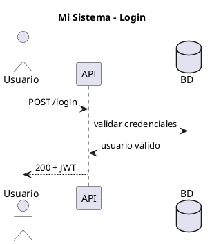

# Guía de Adopción — docs-uml en nuevos proyectos

Este documento explica cómo incorporar el módulo `docs-uml` a cualquier proyecto existente o nuevo,
independientemente del stack tecnológico.

## Tabla de contenidos

1. [Requisitos previos](#requisitos-previos)
2. [Opción A: Copia directa (más simple)](#opción-a-copia-directa)
3. [Opción B: Inicialización asistida (recomendada)](#opción-b-inicialización-asistida)
4. [Configuración del manifiesto](#configuración-del-manifiesto)
5. [Agregar diagramas](#agregar-diagramas)
6. [Generación de documentación](#generación-de-documentación)
7. [Integración con CI/CD](#integración-con-cicd)
8. [Reglas de seguridad](#reglas-de-seguridad)
9. [Personalización por stack tecnológico](#personalización-por-stack-tecnológico)

---

## Requisitos previos

| Herramienta | Versión mínima | Obligatorio | Propósito |
|---|---|---|---|
| Python | 3.10+ | ✅ | Scripts de generación, Sphinx |
| Java JRE | 11+ | Solo para diagramas | PlantUML rendering |
| `plantuml.jar` | Último | Solo para diagramas | Motor PlantUML |
| Git | Cualquiera | ✅ | Versionado de fuentes |
| Docker | Opcional | ❌ | Alternativa a Java/Python local |

---

## Opción A: Copia directa

La más simple. Copia la carpeta `docs-uml/` al repositorio del nuevo proyecto:

```bash
# Desde el repositorio fuente (donde ya existe docs-uml/)
cp -r docs-uml/ /ruta/al/nuevo-proyecto/docs-uml/

# O en Windows
xcopy /E /I "docs-uml" "C:\ruta\nuevo-proyecto\docs-uml"
```

Luego editar:
- `docs-uml/config.yaml` — nombre y versión del nuevo proyecto
- `docs-uml/manifest/manifest.json` — arquitectura del nuevo proyecto
- Agregar `.puml` en `docs-uml/diagrams/plantuml/`

---

## Opción B: Inicialización asistida (recomendada)

Usar el script `init_project.py` para generar la estructura con plantilla predefinida:

```bash
# Instalar dependencias mínimas
python -m venv .venv-docs
.venv-docs/Scripts/Activate.ps1  # Windows
# source .venv-docs/bin/activate  # Linux/macOS

# Inicializar para proyecto Python/FastAPI
python scripts/init_project.py \
  --name "Mesa de Ayuda" \
  --type python \
  --version "1.0.0" \
  --output ../mesa-de-ayuda/docs-uml

# Para Node.js/Express
python scripts/init_project.py \
  --name "API Gateway" \
  --type node \
  --stack "Node.js 22,Express 5,PostgreSQL"

# Ver qué se crearía sin modificar nada
python scripts/init_project.py --name "Test" --type java --dry-run
```

Tipos de proyecto disponibles:

| Tipo | Stack | Capas pre-configuradas |
|------|-------|------------------------|
| `node` | Node.js / Express / NestJS | API, Service, Repository, External |
| `python` | Python / FastAPI / Django | Presentation, Application, Domain, Infrastructure |
| `java` | Java / Spring Boot | Controller, Service, Repository, External |
| `react` | React / Frontend puro | Pages, Components, State, API Client |
| `generic` | Cualquiera | Frontend, Backend, Data, External |

---

## Configuración del manifiesto

El `manifest.json` es el corazón del módulo. Editarlo para reflejar la arquitectura real:

```json
{
  "$schema": "./manifest.schema.json",
  "project": {
    "name": "Nombre del Proyecto",
    "version": "1.0.0",
    "stack": ["Python 3.12", "FastAPI", "PostgreSQL"]
  },
  "layers": [
    { "id": "api", "name": "API", "color": "#3B82F6", "order": 0 },
    { "id": "domain", "name": "Dominio", "color": "#8B5CF6", "order": 1 }
  ],
  "nodes": [
    {
      "id": "auth-router",
      "name": "Auth Router",
      "layer": "api",
      "type": "module",
      "description": "Endpoints de autenticación.",
      "diagrams": ["secuencia_login"],
      "tags": ["auth", "jwt"],
      "visibility": "public"
    }
  ],
  "relations": [
    { "from": "auth-router", "to": "auth-service", "type": "calls", "visibility": "public" }
  ],
  "diagrams": [
    {
      "id": "secuencia_login",
      "title": "Secuencia de Login",
      "type": "sequence",
      "source": "diagrams/plantuml/secuencia_login.puml",
      "format": "plantuml",
      "visibility": "public",
      "order": 1
    }
  ]
}
```

### Validar el manifiesto

```bash
python scripts/validate_manifest.py
```

---

## Agregar diagramas

Colocar archivos `.puml` en `diagrams/plantuml/` y registrarlos en `manifest.json`:



Convención de nombres: `NN_tipo_nombre.puml` (ej: `01_secuencia_login.puml`, `02_clase_usuario.puml`).

---

## Generación de documentación

```bash
# Activar entorno virtual
.venv-docs/Scripts/Activate.ps1

# Validar manifiesto
python scripts/generate.py --validate

# Solo diagramas (requiere Java + plantuml.jar)
python scripts/generate.py --diagrams

# Solo vista interactiva (no requiere Java)
python scripts/generate.py --interactive

# Todo
python scripts/generate.py --all
```

### Abrir resultados

```bash
# Vista interactiva
python -m http.server 8080 --directory output/interactive

# Sphinx (si configurado)
python -m http.server 8081 --directory output/sphinx
```

---

## Integración con CI/CD

El archivo `.github/workflows/docs-build.yml` incluido está listo para usar. Solo requiere:

1. Habilitar **GitHub Pages** en las Settings del repositorio.
2. Fuente: **GitHub Actions**.
3. El workflow se activa en push a `main` cuando hay cambios en `docs-uml/`.

Para un repositorio diferente a GitHub, adaptar el paso de deploy del workflow.

---

## Reglas de seguridad

> ⚠️ Estas reglas son mandatorias para evitar exposición de información sensible.

1. **Nunca incluir** `.env`, credenciales, o tokens en `docs-uml/`.
2. **Siempre ejecutar** `python scripts/sanitize.py` antes de publicar.
3. El campo `sourcePath` de los nodos se elimina automáticamente durante sanitización.
4. Los nodos/diagramas con `"visibility": "internal"` no se incluyen en el manifiesto público.
5. Todas las librerías JS están vendorizadas en `templates/vendor/`. No usar CDN en producción.
6. La carpeta `output/` debe estar en `.gitignore`.

---

## Personalización por stack tecnológico

### Python (FastAPI, Django, Flask)

- Las capas DDD (`presentation`, `application`, `domain`, `infrastructure`) mapean directamente.
- Se puede agregar Sphinx `autodoc` en `conf.py` para extraer docstrings de forma opcional.
- Usar tipo `python` al inicializar.

### Java / Spring Boot

- PlantUML es compatible con javadoc y se puede usar con plugins Maven/Gradle para pre-generar.
- Las capas `@Controller`, `@Service`, `@Repository` mapean directamente a los tipos de nodo.
- Usar tipo `java` al inicializar.

### Node.js / NestJS / Express

- Compatible directamente (es el stack de SECCAP).
- TypeDoc puede complementar Sphinx en una fase posterior.
- Usar tipo `node` al inicializar.

### .NET / ASP.NET

- Reemplazar Sphinx por DocFX si se prefiere, manteniendo los scripts de renderizado PlantUML.
- Las convenciones de capas son similares a Java.
- Usar tipo `generic` y personalizar capas manualmente.

### Microservicios

- Crear un `manifest.json` por servicio en carpetas separadas dentro de `docs-uml/`.
- O crear un manifiesto "global" que agrupe servicios como nodos de tipo `service`.
- El script de generación puede invocarse con `--target` para apuntar a distintos manifiestos.
